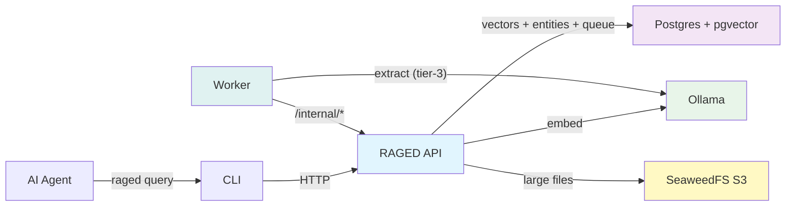

# raged

A vector-first knowledge base for AI agents — ingest any text (code, docs, articles, transcripts, notes), embed it (Ollama or OpenAI), and retrieve relevant context via semantic search and entity-aware retrieval.



## What It Does

1. **Ingest** text or URLs — send content directly to the API via HTTP, fetch web pages/PDFs server-side, or use the CLI to bulk-index Git repositories
2. **Embed** each chunk using Ollama (default local) or OpenAI
3. **Store** embeddings in Postgres with pgvector
4. **Query** by natural language — semantic similarity search for context-rich results
5. **Download** first matched source as raw binary or reconstructed full text via dedicated query endpoints

AI agents (Claude Code, OpenClaw, or any HTTP/CLI-capable agent) use this to retrieve grounded context without stuffing entire knowledge bases into their context window. Vector search finds *what's relevant*; entity metadata helps identify *what's connected*. Graph expansion is currently transitioning to Apache AGE on Postgres (https://age.apache.org/).

## Quickstart

```bash
# Start the base stack (Postgres, Ollama, API)
docker compose up -d

# Or start with enrichment worker
docker compose --profile enrichment up -d

# Or with optional blob storage
docker compose --profile storage --profile enrichment up -d

# Pull the embedding model (first time only)
curl http://localhost:11434/api/pull -d '{"name":"nomic-embed-text"}'

# Verify
curl -s http://localhost:8080/healthz
# → {"ok":true}
```

## Ingest Content

Via the HTTP API (text or URLs):

```bash
# Ingest text directly
curl -s -X POST http://localhost:8080/ingest \
  -H "Content-Type: application/json" \
  -d '{
    "items": [{
      "id": "my-doc",
      "text": "Your text content here...",
      "source": "notes/meeting.md"
    }]
  }'

# Ingest from URL (server-side fetch)
curl -s -X POST http://localhost:8080/ingest \
  -H "Content-Type: application/json" \
  -d '{
    "items": [{
      "url": "https://example.com/article"
    }]
  }'
```

Via the CLI (bulk Git repository indexing):

```bash
cd cli && npm install && npm run build

node dist/index.js index \
  --repo https://github.com/<org>/<repo>.git \
  --api http://localhost:8080
```

## Query

```bash
curl -s -X POST http://localhost:8080/query \
  -H "Content-Type: application/json" \
  -d '{"query": "authentication flow", "topK": 5}'

# Or via CLI
node dist/index.js query \
  --api http://localhost:8080 \
  --q "authentication flow" \
  --topK 5
```

## Components

| Component | Role | Tech |
|-----------|------|------|
| **RAGED API** | Chunk, embed, store, search, orchestrate enrichment | Fastify, Node.js |
| **Postgres** | Vector storage (pgvector), entities, task queue | Postgres 17 + pgvector |
| **Ollama / OpenAI** | Embedding + extraction providers | Ollama local models or OpenAI APIs |
| **SeaweedFS** | Optional S3-compatible blob storage for large files | SeaweedFS 3.80 |
| **Enrichment Worker** | Async metadata extraction *(optional)* | Python, spaCy, asyncio |
| **CLI** | Bulk-index Git repos and query from terminal | Node.js, TypeScript |
| **Helm Chart** | Kubernetes deployment | Helm 3 |

## Documentation

Documentation Site (GitHub Pages): https://mfittko.github.io/RAGed/

| Doc | Topic |
|-----|-------|
| [Vision & Roadmap](docs/00-vision.md) | Where raged is headed |
| [Architecture](docs/01-architecture.md) | Components, data flow, security |
| [Local Development](docs/02-local-dev.md) | Docker Compose setup |
| [CLI Reference](docs/03-cli.md) | Commands, flags, examples |
| [Agent Integrations](docs/04-claude-skills.md) | Using raged with Claude Code, OpenClaw, etc. |
| [Helm Deployment](docs/05-helm-remote.md) | Kubernetes + Ingress + auth |
| [Troubleshooting](docs/06-troubleshooting.md) | Common issues and fixes |
| [In-Cluster Indexing](docs/07-indexing-in-cluster.md) | Indexing from inside Kubernetes |
| [Contributing](docs/08-contributing.md) | Development setup and PR process |
| [API Reference](docs/09-api-reference.md) | Endpoints, request/response formats |

## License

See [LICENSE](LICENSE).
