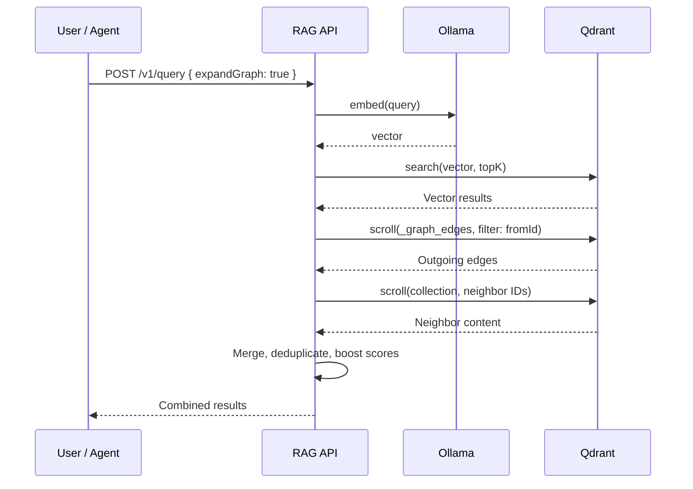

# v1.0 Graph Layer Implementation Plan

> **For Claude:** REQUIRED SUB-SKILL: Use superpowers:executing-plans to implement this plan task-by-task.

**Goal:** Add a relationship tracking graph layer to rag-stack, enabling typed directed edges between ingested content and relationship-aware hybrid queries (vector similarity + graph traversal).

**Architecture:** Start with adjacency lists stored in Qdrant payloads (no external graph DB dependency for v1.0). Add `POST /v1/link` endpoint for creating edges, `GET /v1/links/:id` for retrieving edges, and `POST /v1/query` enhanced with `expandGraph: true` option that fetches graph neighbors of top results. This approach keeps the single-database simplicity while proving the graph concept. v2.0 can migrate to Neo4j if needed.

**Tech Stack:** TypeScript, Fastify, Qdrant (payloads for adjacency lists), Vitest

**Depends on:** v1.0 Production Hardening plan must be complete (VectorStore interface, API versioning, service layer).

---

### Task 1: Define graph types and interfaces

**Files:**
- Create: `api/src/interfaces/graph.ts`
- Create: `api/src/interfaces/graph.test.ts`

**Step 1: Write the failing type-level test**

Create `api/src/interfaces/graph.test.ts`:

```typescript
import { describe, it, expectTypeOf } from "vitest";
import type { GraphEdge, LinkType, GraphStore } from "./graph.js";

describe("graph types", () => {
  it("GraphEdge has required fields", () => {
    expectTypeOf<GraphEdge>().toHaveProperty("id");
    expectTypeOf<GraphEdge>().toHaveProperty("fromId");
    expectTypeOf<GraphEdge>().toHaveProperty("toId");
    expectTypeOf<GraphEdge>().toHaveProperty("linkType");
    expectTypeOf<GraphEdge>().toHaveProperty("createdAt");
  });

  it("GraphEdge.id is a string", () => {
    expectTypeOf<GraphEdge["id"]>().toBeString();
  });

  it("GraphEdge.fromId is a string", () => {
    expectTypeOf<GraphEdge["fromId"]>().toBeString();
  });

  it("GraphEdge.toId is a string", () => {
    expectTypeOf<GraphEdge["toId"]>().toBeString();
  });

  it("GraphEdge.linkType is LinkType", () => {
    expectTypeOf<GraphEdge["linkType"]>().toEqualTypeOf<LinkType>();
  });

  it("GraphEdge.metadata is optional Record<string, unknown>", () => {
    expectTypeOf<GraphEdge["metadata"]>().toEqualTypeOf<
      Record<string, unknown> | undefined
    >();
  });

  it("GraphEdge.createdAt is a string", () => {
    expectTypeOf<GraphEdge["createdAt"]>().toBeString();
  });

  it("LinkType accepts valid values", () => {
    const valid: LinkType[] = [
      "references",
      "depends-on",
      "discusses",
      "supersedes",
      "authored-by",
    ];
    expectTypeOf(valid).toEqualTypeOf<LinkType[]>();
  });

  it("GraphStore has createEdge method", () => {
    expectTypeOf<GraphStore>().toHaveProperty("createEdge");
  });

  it("GraphStore has getEdgesFrom method", () => {
    expectTypeOf<GraphStore>().toHaveProperty("getEdgesFrom");
  });

  it("GraphStore has getEdgesTo method", () => {
    expectTypeOf<GraphStore>().toHaveProperty("getEdgesTo");
  });

  it("GraphStore has deleteEdge method", () => {
    expectTypeOf<GraphStore>().toHaveProperty("deleteEdge");
  });

  it("GraphStore.createEdge returns Promise<GraphEdge>", () => {
    expectTypeOf<GraphStore["createEdge"]>().returns.resolves.toEqualTypeOf<GraphEdge>();
  });

  it("GraphStore.getEdgesFrom returns Promise<GraphEdge[]>", () => {
    expectTypeOf<GraphStore["getEdgesFrom"]>().returns.resolves.toEqualTypeOf<GraphEdge[]>();
  });

  it("GraphStore.getEdgesTo returns Promise<GraphEdge[]>", () => {
    expectTypeOf<GraphStore["getEdgesTo"]>().returns.resolves.toEqualTypeOf<GraphEdge[]>();
  });

  it("GraphStore.deleteEdge returns Promise<boolean>", () => {
    expectTypeOf<GraphStore["deleteEdge"]>().returns.resolves.toEqualTypeOf<boolean>();
  });
});
```

Run:

```bash
cd api && npx vitest run src/interfaces/graph.test.ts
```

Expected: **FAIL** — module `./graph.js` does not exist.

**Step 2: Implement the graph types**

Create `api/src/interfaces/graph.ts`:

```typescript
/**
 * Valid relationship types for graph edges.
 *
 * - "references"  — source references target (e.g., doc cites code)
 * - "depends-on"  — source depends on target (e.g., library dependency)
 * - "discusses"   — source discusses target (e.g., email about a design)
 * - "supersedes"  — source replaces target (e.g., v2 supersedes v1)
 * - "authored-by" — source was authored by target (e.g., code authored by person)
 */
export type LinkType =
  | "references"
  | "depends-on"
  | "discusses"
  | "supersedes"
  | "authored-by";

/**
 * A typed, directed edge between two content items.
 */
export interface GraphEdge {
  /** Deterministic ID: `${fromId}:${linkType}:${toId}` */
  id: string;
  /** Source content item ID */
  fromId: string;
  /** Target content item ID */
  toId: string;
  /** Relationship type */
  linkType: LinkType;
  /** Optional edge metadata */
  metadata?: Record<string, unknown>;
  /** ISO 8601 creation timestamp */
  createdAt: string;
}

/**
 * Input for creating a new edge. The `id` and `createdAt` are generated
 * by the store implementation.
 */
export interface CreateEdgeInput {
  fromId: string;
  toId: string;
  linkType: LinkType;
  metadata?: Record<string, unknown>;
}

/**
 * Abstraction over graph edge storage. Implementations must support
 * CRUD operations on directed edges and filtering by source/target.
 */
export interface GraphStore {
  /** Create or update an edge. Returns the full edge with generated ID and timestamp. */
  createEdge(input: CreateEdgeInput): Promise<GraphEdge>;

  /** Get all outgoing edges from a given content item ID. */
  getEdgesFrom(fromId: string): Promise<GraphEdge[]>;

  /** Get all incoming edges to a given content item ID. */
  getEdgesTo(toId: string): Promise<GraphEdge[]>;

  /** Delete an edge by fromId, toId, and linkType. Returns true if the edge existed. */
  deleteEdge(fromId: string, toId: string, linkType: LinkType): Promise<boolean>;
}

/** All valid link types as an array, useful for validation. */
export const LINK_TYPES: readonly LinkType[] = [
  "references",
  "depends-on",
  "discusses",
  "supersedes",
  "authored-by",
] as const;

/** Type guard for LinkType validation. */
export function isLinkType(value: unknown): value is LinkType {
  return typeof value === "string" && (LINK_TYPES as readonly string[]).includes(value);
}
```

Run:

```bash
cd api && npx vitest run src/interfaces/graph.test.ts
```

Expected: **PASS** — all type-level tests pass.

**Step 3: Commit**

```bash
git add api/src/interfaces/graph.ts api/src/interfaces/graph.test.ts
git commit -m "feat: define graph types and GraphStore interface"
```

---

### Task 2: Implement QdrantGraphStore

**Files:**
- Create: `api/src/graph/qdrant-graph-store.ts`
- Create: `api/src/graph/qdrant-graph-store.test.ts`

**Step 1: Write failing unit tests with mocked Qdrant client**

Create `api/src/graph/qdrant-graph-store.test.ts`:

```typescript
import { describe, it, expect, vi, beforeEach } from "vitest";
import { QdrantGraphStore } from "./qdrant-graph-store.js";
import type { QdrantClient } from "@qdrant/js-client-rest";
import type { CreateEdgeInput, GraphEdge } from "../interfaces/graph.js";

function createMockQdrant(): {
  client: QdrantClient;
  getCollections: ReturnType<typeof vi.fn>;
  createCollection: ReturnType<typeof vi.fn>;
  upsert: ReturnType<typeof vi.fn>;
  scroll: ReturnType<typeof vi.fn>;
  delete: ReturnType<typeof vi.fn>;
  retrieve: ReturnType<typeof vi.fn>;
} {
  const getCollections = vi.fn().mockResolvedValue({ collections: [] });
  const createCollection = vi.fn().mockResolvedValue({});
  const upsert = vi.fn().mockResolvedValue({});
  const scroll = vi.fn().mockResolvedValue({ points: [] });
  const deleteFn = vi.fn().mockResolvedValue({});
  const retrieve = vi.fn().mockResolvedValue([]);

  const client = {
    getCollections,
    createCollection,
    upsert,
    scroll,
    delete: deleteFn,
    retrieve,
  } as unknown as QdrantClient;

  return {
    client,
    getCollections,
    createCollection,
    upsert,
    scroll,
    delete: deleteFn,
    retrieve,
  };
}

describe("QdrantGraphStore", () => {
  let mock: ReturnType<typeof createMockQdrant>;
  let store: QdrantGraphStore;

  beforeEach(() => {
    mock = createMockQdrant();
    store = new QdrantGraphStore(mock.client);
  });

  describe("ensureCollection", () => {
    it("creates _graph_edges collection if it does not exist", async () => {
      mock.getCollections.mockResolvedValue({ collections: [] });

      await store.ensureCollection();

      expect(mock.createCollection).toHaveBeenCalledWith("_graph_edges", {
        vectors: { size: 1, distance: "Cosine" },
      });
    });

    it("skips creation if collection already exists", async () => {
      mock.getCollections.mockResolvedValue({
        collections: [{ name: "_graph_edges" }],
      });

      await store.ensureCollection();

      expect(mock.createCollection).not.toHaveBeenCalled();
    });
  });

  describe("createEdge", () => {
    it("upserts a point with deterministic ID and edge payload", async () => {
      const input: CreateEdgeInput = {
        fromId: "doc-1",
        toId: "doc-2",
        linkType: "references",
        metadata: { confidence: 0.95 },
      };

      // Ensure collection exists
      mock.getCollections.mockResolvedValue({
        collections: [{ name: "_graph_edges" }],
      });

      const edge = await store.createEdge(input);

      expect(edge.id).toBe("doc-1:references:doc-2");
      expect(edge.fromId).toBe("doc-1");
      expect(edge.toId).toBe("doc-2");
      expect(edge.linkType).toBe("references");
      expect(edge.metadata).toEqual({ confidence: 0.95 });
      expect(edge.createdAt).toBeDefined();
      expect(typeof edge.createdAt).toBe("string");

      expect(mock.upsert).toHaveBeenCalledWith("_graph_edges", {
        wait: true,
        points: [
          {
            id: expect.any(String),
            vector: [0],
            payload: {
              edgeId: "doc-1:references:doc-2",
              fromId: "doc-1",
              toId: "doc-2",
              linkType: "references",
              metadata: { confidence: 0.95 },
              createdAt: edge.createdAt,
            },
          },
        ],
      });
    });

    it("creates edge without optional metadata", async () => {
      const input: CreateEdgeInput = {
        fromId: "doc-1",
        toId: "doc-2",
        linkType: "depends-on",
      };

      mock.getCollections.mockResolvedValue({
        collections: [{ name: "_graph_edges" }],
      });

      const edge = await store.createEdge(input);

      expect(edge.id).toBe("doc-1:depends-on:doc-2");
      expect(edge.metadata).toBeUndefined();
    });
  });

  describe("getEdgesFrom", () => {
    it("returns outgoing edges filtered by fromId", async () => {
      mock.getCollections.mockResolvedValue({
        collections: [{ name: "_graph_edges" }],
      });

      mock.scroll.mockResolvedValue({
        points: [
          {
            id: "abc-uuid-1",
            payload: {
              edgeId: "doc-1:references:doc-2",
              fromId: "doc-1",
              toId: "doc-2",
              linkType: "references",
              metadata: {},
              createdAt: "2026-02-14T00:00:00.000Z",
            },
          },
          {
            id: "abc-uuid-2",
            payload: {
              edgeId: "doc-1:discusses:doc-3",
              fromId: "doc-1",
              toId: "doc-3",
              linkType: "discusses",
              createdAt: "2026-02-14T00:00:00.000Z",
            },
          },
        ],
      });

      const edges = await store.getEdgesFrom("doc-1");

      expect(edges).toHaveLength(2);
      expect(edges[0].id).toBe("doc-1:references:doc-2");
      expect(edges[0].fromId).toBe("doc-1");
      expect(edges[0].toId).toBe("doc-2");
      expect(edges[1].id).toBe("doc-1:discusses:doc-3");

      expect(mock.scroll).toHaveBeenCalledWith("_graph_edges", {
        filter: {
          must: [{ key: "fromId", match: { value: "doc-1" } }],
        },
        with_payload: true,
        limit: 100,
      });
    });

    it("returns empty array when no edges exist", async () => {
      mock.getCollections.mockResolvedValue({
        collections: [{ name: "_graph_edges" }],
      });

      mock.scroll.mockResolvedValue({ points: [] });

      const edges = await store.getEdgesFrom("nonexistent");
      expect(edges).toEqual([]);
    });
  });

  describe("getEdgesTo", () => {
    it("returns incoming edges filtered by toId", async () => {
      mock.getCollections.mockResolvedValue({
        collections: [{ name: "_graph_edges" }],
      });

      mock.scroll.mockResolvedValue({
        points: [
          {
            id: "abc-uuid-1",
            payload: {
              edgeId: "doc-1:references:doc-2",
              fromId: "doc-1",
              toId: "doc-2",
              linkType: "references",
              createdAt: "2026-02-14T00:00:00.000Z",
            },
          },
        ],
      });

      const edges = await store.getEdgesTo("doc-2");

      expect(edges).toHaveLength(1);
      expect(edges[0].toId).toBe("doc-2");
      expect(edges[0].fromId).toBe("doc-1");

      expect(mock.scroll).toHaveBeenCalledWith("_graph_edges", {
        filter: {
          must: [{ key: "toId", match: { value: "doc-2" } }],
        },
        with_payload: true,
        limit: 100,
      });
    });
  });

  describe("deleteEdge", () => {
    it("deletes an existing edge and returns true", async () => {
      mock.getCollections.mockResolvedValue({
        collections: [{ name: "_graph_edges" }],
      });

      // Simulate finding the edge point
      mock.scroll.mockResolvedValue({
        points: [
          {
            id: "abc-uuid-1",
            payload: {
              edgeId: "doc-1:references:doc-2",
              fromId: "doc-1",
              toId: "doc-2",
              linkType: "references",
              createdAt: "2026-02-14T00:00:00.000Z",
            },
          },
        ],
      });

      const result = await store.deleteEdge("doc-1", "doc-2", "references");

      expect(result).toBe(true);
      expect(mock.delete).toHaveBeenCalledWith("_graph_edges", {
        wait: true,
        filter: {
          must: [
            { key: "fromId", match: { value: "doc-1" } },
            { key: "toId", match: { value: "doc-2" } },
            { key: "linkType", match: { value: "references" } },
          ],
        },
      });
    });

    it("returns false when edge does not exist", async () => {
      mock.getCollections.mockResolvedValue({
        collections: [{ name: "_graph_edges" }],
      });

      mock.scroll.mockResolvedValue({ points: [] });

      const result = await store.deleteEdge("doc-1", "doc-2", "references");

      expect(result).toBe(false);
      expect(mock.delete).not.toHaveBeenCalled();
    });
  });
});
```

Run:

```bash
cd api && npx vitest run src/graph/qdrant-graph-store.test.ts
```

Expected: **FAIL** — module `./qdrant-graph-store.js` does not exist.

**Step 2: Implement the QdrantGraphStore**

Create `api/src/graph/qdrant-graph-store.ts`:

```typescript
import type { QdrantClient } from "@qdrant/js-client-rest";
import { randomUUID } from "node:crypto";
import type {
  GraphStore,
  GraphEdge,
  CreateEdgeInput,
  LinkType,
} from "../interfaces/graph.js";

const GRAPH_COLLECTION = "_graph_edges";

/**
 * Converts a Qdrant point payload into a GraphEdge.
 */
function payloadToEdge(payload: Record<string, unknown>): GraphEdge {
  return {
    id: payload.edgeId as string,
    fromId: payload.fromId as string,
    toId: payload.toId as string,
    linkType: payload.linkType as LinkType,
    metadata: payload.metadata as Record<string, unknown> | undefined,
    createdAt: payload.createdAt as string,
  };
}

/**
 * Generates a deterministic edge ID from its components.
 */
function edgeId(fromId: string, linkType: LinkType, toId: string): string {
  return `${fromId}:${linkType}:${toId}`;
}

/**
 * Graph store backed by a dedicated Qdrant collection (`_graph_edges`).
 *
 * Each edge is stored as a Qdrant point with a dummy zero vector (size 1).
 * Edge data lives entirely in the payload. We use Qdrant's filtering
 * capabilities to query edges by fromId, toId, or linkType.
 */
export class QdrantGraphStore implements GraphStore {
  private client: QdrantClient;
  private collectionReady = false;

  constructor(client: QdrantClient) {
    this.client = client;
  }

  /**
   * Ensures the `_graph_edges` collection exists in Qdrant.
   * Uses a size-1 dummy vector since edges don't need embeddings.
   */
  async ensureCollection(): Promise<void> {
    if (this.collectionReady) return;

    const collections = await this.client.getCollections();
    const exists = collections.collections?.some(
      (c) => c.name === GRAPH_COLLECTION
    );

    if (!exists) {
      await this.client.createCollection(GRAPH_COLLECTION, {
        vectors: { size: 1, distance: "Cosine" },
      });
    }

    this.collectionReady = true;
  }

  async createEdge(input: CreateEdgeInput): Promise<GraphEdge> {
    await this.ensureCollection();

    const id = edgeId(input.fromId, input.linkType, input.toId);
    const createdAt = new Date().toISOString();

    const payload: Record<string, unknown> = {
      edgeId: id,
      fromId: input.fromId,
      toId: input.toId,
      linkType: input.linkType,
      createdAt,
    };

    if (input.metadata !== undefined) {
      payload.metadata = input.metadata;
    }

    await this.client.upsert(GRAPH_COLLECTION, {
      wait: true,
      points: [
        {
          id: randomUUID(),
          vector: [0],
          payload,
        },
      ],
    });

    const edge: GraphEdge = {
      id,
      fromId: input.fromId,
      toId: input.toId,
      linkType: input.linkType,
      createdAt,
    };

    if (input.metadata !== undefined) {
      edge.metadata = input.metadata;
    }

    return edge;
  }

  async getEdgesFrom(fromId: string): Promise<GraphEdge[]> {
    await this.ensureCollection();

    const result = await this.client.scroll(GRAPH_COLLECTION, {
      filter: {
        must: [{ key: "fromId", match: { value: fromId } }],
      },
      with_payload: true,
      limit: 100,
    });

    return (result.points ?? []).map((p) =>
      payloadToEdge(p.payload as Record<string, unknown>)
    );
  }

  async getEdgesTo(toId: string): Promise<GraphEdge[]> {
    await this.ensureCollection();

    const result = await this.client.scroll(GRAPH_COLLECTION, {
      filter: {
        must: [{ key: "toId", match: { value: toId } }],
      },
      with_payload: true,
      limit: 100,
    });

    return (result.points ?? []).map((p) =>
      payloadToEdge(p.payload as Record<string, unknown>)
    );
  }

  async deleteEdge(
    fromId: string,
    toId: string,
    linkType: LinkType
  ): Promise<boolean> {
    await this.ensureCollection();

    // First check if the edge exists
    const existing = await this.client.scroll(GRAPH_COLLECTION, {
      filter: {
        must: [
          { key: "fromId", match: { value: fromId } },
          { key: "toId", match: { value: toId } },
          { key: "linkType", match: { value: linkType } },
        ],
      },
      with_payload: true,
      limit: 1,
    });

    if (!existing.points || existing.points.length === 0) {
      return false;
    }

    await this.client.delete(GRAPH_COLLECTION, {
      wait: true,
      filter: {
        must: [
          { key: "fromId", match: { value: fromId } },
          { key: "toId", match: { value: toId } },
          { key: "linkType", match: { value: linkType } },
        ],
      },
    });

    return true;
  }
}
```

Run:

```bash
cd api && npx vitest run src/graph/qdrant-graph-store.test.ts
```

Expected: **PASS** — all 7 tests pass.

**Step 3: Commit**

```bash
git add api/src/graph/qdrant-graph-store.ts api/src/graph/qdrant-graph-store.test.ts
git commit -m "feat: implement QdrantGraphStore with adjacency lists in Qdrant payloads"
```

---

### Task 3: Add POST /v1/link endpoint

**Files:**
- Create: `api/src/services/link.ts`
- Create: `api/src/services/link.test.ts`
- Modify: `api/src/server.ts`

**Step 1: Write failing tests for the link service**

Create `api/src/services/link.test.ts`:

```typescript
import { describe, it, expect, vi, beforeEach } from "vitest";
import { createLinkService } from "./link.js";
import type { GraphStore, GraphEdge, CreateEdgeInput } from "../interfaces/graph.js";

function createMockGraphStore(): GraphStore & {
  createEdge: ReturnType<typeof vi.fn>;
  getEdgesFrom: ReturnType<typeof vi.fn>;
  getEdgesTo: ReturnType<typeof vi.fn>;
  deleteEdge: ReturnType<typeof vi.fn>;
} {
  return {
    createEdge: vi.fn(),
    getEdgesFrom: vi.fn(),
    getEdgesTo: vi.fn(),
    deleteEdge: vi.fn(),
  };
}

describe("createLinkService", () => {
  let mockStore: ReturnType<typeof createMockGraphStore>;
  let service: ReturnType<typeof createLinkService>;

  beforeEach(() => {
    mockStore = createMockGraphStore();
    service = createLinkService(mockStore);
  });

  describe("createLink", () => {
    it("creates a link and returns the edge", async () => {
      const expectedEdge: GraphEdge = {
        id: "doc-1:references:doc-2",
        fromId: "doc-1",
        toId: "doc-2",
        linkType: "references",
        createdAt: "2026-02-14T00:00:00.000Z",
      };

      mockStore.createEdge.mockResolvedValue(expectedEdge);

      const result = await service.createLink({
        from: "doc-1",
        to: "doc-2",
        type: "references",
      });

      expect(result).toEqual(expectedEdge);
      expect(mockStore.createEdge).toHaveBeenCalledWith({
        fromId: "doc-1",
        toId: "doc-2",
        linkType: "references",
        metadata: undefined,
      });
    });

    it("creates a link with metadata", async () => {
      const expectedEdge: GraphEdge = {
        id: "doc-1:depends-on:lib-1",
        fromId: "doc-1",
        toId: "lib-1",
        linkType: "depends-on",
        metadata: { version: "1.2.0" },
        createdAt: "2026-02-14T00:00:00.000Z",
      };

      mockStore.createEdge.mockResolvedValue(expectedEdge);

      const result = await service.createLink({
        from: "doc-1",
        to: "lib-1",
        type: "depends-on",
        metadata: { version: "1.2.0" },
      });

      expect(result).toEqual(expectedEdge);
      expect(mockStore.createEdge).toHaveBeenCalledWith({
        fromId: "doc-1",
        toId: "lib-1",
        linkType: "depends-on",
        metadata: { version: "1.2.0" },
      });
    });

    it("throws on invalid link type", async () => {
      await expect(
        service.createLink({
          from: "doc-1",
          to: "doc-2",
          type: "invalid-type" as "references",
        })
      ).rejects.toThrow("Invalid link type");
    });

    it("throws when from is empty", async () => {
      await expect(
        service.createLink({
          from: "",
          to: "doc-2",
          type: "references",
        })
      ).rejects.toThrow("'from' is required");
    });

    it("throws when to is empty", async () => {
      await expect(
        service.createLink({
          from: "doc-1",
          to: "",
          type: "references",
        })
      ).rejects.toThrow("'to' is required");
    });
  });
});
```

Run:

```bash
cd api && npx vitest run src/services/link.test.ts
```

Expected: **FAIL** — module `./link.js` does not exist.

**Step 2: Implement the link service**

Create `api/src/services/link.ts`:

```typescript
import type { GraphStore, GraphEdge } from "../interfaces/graph.js";
import { isLinkType } from "../interfaces/graph.js";
import type { LinkType } from "../interfaces/graph.js";

export interface CreateLinkInput {
  from: string;
  to: string;
  type: string;
  metadata?: Record<string, unknown>;
}

export interface LinkService {
  createLink(input: CreateLinkInput): Promise<GraphEdge>;
  getLinks(id: string, direction: "from" | "to" | "both"): Promise<GraphEdge[]>;
  deleteLink(from: string, to: string, type: string): Promise<boolean>;
}

export function createLinkService(graphStore: GraphStore): LinkService {
  return {
    async createLink(input: CreateLinkInput): Promise<GraphEdge> {
      if (!input.from) {
        throw new Error("'from' is required");
      }
      if (!input.to) {
        throw new Error("'to' is required");
      }
      if (!isLinkType(input.type)) {
        throw new Error(
          `Invalid link type: '${input.type}'. Valid types: references, depends-on, discusses, supersedes, authored-by`
        );
      }

      return graphStore.createEdge({
        fromId: input.from,
        toId: input.to,
        linkType: input.type as LinkType,
        metadata: input.metadata,
      });
    },

    async getLinks(
      id: string,
      direction: "from" | "to" | "both" = "from"
    ): Promise<GraphEdge[]> {
      if (!id) {
        throw new Error("'id' is required");
      }

      if (direction === "from") {
        return graphStore.getEdgesFrom(id);
      }
      if (direction === "to") {
        return graphStore.getEdgesTo(id);
      }

      // direction === "both"
      const [outgoing, incoming] = await Promise.all([
        graphStore.getEdgesFrom(id),
        graphStore.getEdgesTo(id),
      ]);

      // Deduplicate by edge ID
      const seen = new Set<string>();
      const combined: GraphEdge[] = [];

      for (const edge of [...outgoing, ...incoming]) {
        if (!seen.has(edge.id)) {
          seen.add(edge.id);
          combined.push(edge);
        }
      }

      return combined;
    },

    async deleteLink(from: string, to: string, type: string): Promise<boolean> {
      if (!from) {
        throw new Error("'from' is required");
      }
      if (!to) {
        throw new Error("'to' is required");
      }
      if (!isLinkType(type)) {
        throw new Error(
          `Invalid link type: '${type}'. Valid types: references, depends-on, discusses, supersedes, authored-by`
        );
      }

      return graphStore.deleteEdge(from, to, type as LinkType);
    },
  };
}
```

Run:

```bash
cd api && npx vitest run src/services/link.test.ts
```

Expected: **PASS** — all 5 tests pass.

**Step 3: Write failing integration tests for POST /v1/link route**

Create `api/src/routes/link.test.ts`:

```typescript
import { describe, it, expect, vi, beforeEach } from "vitest";
import Fastify from "fastify";
import type { FastifyInstance } from "fastify";
import { registerLinkRoutes } from "./link.js";
import type { LinkService } from "../services/link.js";
import type { GraphEdge } from "../interfaces/graph.js";

function createMockLinkService(): LinkService & {
  createLink: ReturnType<typeof vi.fn>;
  getLinks: ReturnType<typeof vi.fn>;
  deleteLink: ReturnType<typeof vi.fn>;
} {
  return {
    createLink: vi.fn(),
    getLinks: vi.fn(),
    deleteLink: vi.fn(),
  };
}

describe("POST /v1/link", () => {
  let app: FastifyInstance;
  let mockService: ReturnType<typeof createMockLinkService>;

  beforeEach(async () => {
    app = Fastify();
    mockService = createMockLinkService();
    registerLinkRoutes(app, mockService);
    await app.ready();
  });

  it("creates a link and returns 201", async () => {
    const edge: GraphEdge = {
      id: "doc-1:references:doc-2",
      fromId: "doc-1",
      toId: "doc-2",
      linkType: "references",
      createdAt: "2026-02-14T00:00:00.000Z",
    };

    mockService.createLink.mockResolvedValue(edge);

    const response = await app.inject({
      method: "POST",
      url: "/v1/link",
      payload: {
        from: "doc-1",
        to: "doc-2",
        type: "references",
      },
    });

    expect(response.statusCode).toBe(201);
    const body = JSON.parse(response.body);
    expect(body.ok).toBe(true);
    expect(body.edge.id).toBe("doc-1:references:doc-2");
    expect(body.edge.fromId).toBe("doc-1");
    expect(body.edge.toId).toBe("doc-2");
    expect(body.edge.linkType).toBe("references");
  });

  it("returns 400 for invalid link type", async () => {
    const response = await app.inject({
      method: "POST",
      url: "/v1/link",
      payload: {
        from: "doc-1",
        to: "doc-2",
        type: "invalid",
      },
    });

    expect(response.statusCode).toBe(400);
    const body = JSON.parse(response.body);
    expect(body.error).toContain("type");
  });

  it("returns 400 when from is missing", async () => {
    const response = await app.inject({
      method: "POST",
      url: "/v1/link",
      payload: {
        to: "doc-2",
        type: "references",
      },
    });

    expect(response.statusCode).toBe(400);
    const body = JSON.parse(response.body);
    expect(body.error).toBeDefined();
  });

  it("returns 400 when to is missing", async () => {
    const response = await app.inject({
      method: "POST",
      url: "/v1/link",
      payload: {
        from: "doc-1",
        type: "references",
      },
    });

    expect(response.statusCode).toBe(400);
    const body = JSON.parse(response.body);
    expect(body.error).toBeDefined();
  });

  it("passes metadata through to the service", async () => {
    const edge: GraphEdge = {
      id: "doc-1:depends-on:lib-1",
      fromId: "doc-1",
      toId: "lib-1",
      linkType: "depends-on",
      metadata: { version: "2.0" },
      createdAt: "2026-02-14T00:00:00.000Z",
    };

    mockService.createLink.mockResolvedValue(edge);

    const response = await app.inject({
      method: "POST",
      url: "/v1/link",
      payload: {
        from: "doc-1",
        to: "lib-1",
        type: "depends-on",
        metadata: { version: "2.0" },
      },
    });

    expect(response.statusCode).toBe(201);
    expect(mockService.createLink).toHaveBeenCalledWith({
      from: "doc-1",
      to: "lib-1",
      type: "depends-on",
      metadata: { version: "2.0" },
    });
  });
});
```

Run:

```bash
cd api && npx vitest run src/routes/link.test.ts
```

Expected: **FAIL** — module `./link.js` does not exist.

**Step 4: Implement the link route handler**

Create `api/src/routes/link.ts`:

```typescript
import type { FastifyInstance, FastifyRequest, FastifyReply } from "fastify";
import type { LinkService } from "../services/link.js";
import { LINK_TYPES } from "../interfaces/graph.js";

const createLinkSchema = {
  body: {
    type: "object",
    required: ["from", "to", "type"],
    properties: {
      from: { type: "string", minLength: 1 },
      to: { type: "string", minLength: 1 },
      type: { type: "string", enum: [...LINK_TYPES] },
      metadata: { type: "object", additionalProperties: true },
    },
    additionalProperties: false,
  },
};

interface CreateLinkBody {
  from: string;
  to: string;
  type: string;
  metadata?: Record<string, unknown>;
}

export function registerLinkRoutes(
  app: FastifyInstance,
  linkService: LinkService
): void {
  app.post<{ Body: CreateLinkBody }>(
    "/v1/link",
    { schema: createLinkSchema },
    async (
      request: FastifyRequest<{ Body: CreateLinkBody }>,
      reply: FastifyReply
    ) => {
      try {
        const edge = await linkService.createLink({
          from: request.body.from,
          to: request.body.to,
          type: request.body.type,
          metadata: request.body.metadata,
        });

        return reply.code(201).send({ ok: true, edge });
      } catch (err: unknown) {
        const message = err instanceof Error ? err.message : "Unknown error";
        return reply.code(400).send({ error: message });
      }
    }
  );
}
```

Run:

```bash
cd api && npx vitest run src/routes/link.test.ts
```

Expected: **PASS** — all 5 tests pass.

**Step 5: Commit**

```bash
git add api/src/services/link.ts api/src/services/link.test.ts \
       api/src/routes/link.ts api/src/routes/link.test.ts
git commit -m "feat: add POST /v1/link endpoint for creating graph edges"
```

---

### Task 4: Add GET /v1/links/:id endpoint

**Files:**
- Modify: `api/src/routes/link.ts`
- Modify: `api/src/routes/link.test.ts`

**Step 1: Write failing tests for GET /v1/links/:id**

Add to `api/src/routes/link.test.ts`:

```typescript
describe("GET /v1/links/:id", () => {
  let app: FastifyInstance;
  let mockService: ReturnType<typeof createMockLinkService>;

  beforeEach(async () => {
    app = Fastify();
    mockService = createMockLinkService();
    registerLinkRoutes(app, mockService);
    await app.ready();
  });

  it("returns outgoing edges by default", async () => {
    const edges: GraphEdge[] = [
      {
        id: "doc-1:references:doc-2",
        fromId: "doc-1",
        toId: "doc-2",
        linkType: "references",
        createdAt: "2026-02-14T00:00:00.000Z",
      },
    ];

    mockService.getLinks.mockResolvedValue(edges);

    const response = await app.inject({
      method: "GET",
      url: "/v1/links/doc-1",
    });

    expect(response.statusCode).toBe(200);
    const body = JSON.parse(response.body);
    expect(body.ok).toBe(true);
    expect(body.edges).toHaveLength(1);
    expect(body.edges[0].id).toBe("doc-1:references:doc-2");
    expect(mockService.getLinks).toHaveBeenCalledWith("doc-1", "from");
  });

  it("returns incoming edges when direction=to", async () => {
    const edges: GraphEdge[] = [
      {
        id: "doc-0:depends-on:doc-1",
        fromId: "doc-0",
        toId: "doc-1",
        linkType: "depends-on",
        createdAt: "2026-02-14T00:00:00.000Z",
      },
    ];

    mockService.getLinks.mockResolvedValue(edges);

    const response = await app.inject({
      method: "GET",
      url: "/v1/links/doc-1?direction=to",
    });

    expect(response.statusCode).toBe(200);
    const body = JSON.parse(response.body);
    expect(body.ok).toBe(true);
    expect(body.edges).toHaveLength(1);
    expect(mockService.getLinks).toHaveBeenCalledWith("doc-1", "to");
  });

  it("returns both directions when direction=both", async () => {
    const edges: GraphEdge[] = [
      {
        id: "doc-1:references:doc-2",
        fromId: "doc-1",
        toId: "doc-2",
        linkType: "references",
        createdAt: "2026-02-14T00:00:00.000Z",
      },
      {
        id: "doc-0:depends-on:doc-1",
        fromId: "doc-0",
        toId: "doc-1",
        linkType: "depends-on",
        createdAt: "2026-02-14T00:00:00.000Z",
      },
    ];

    mockService.getLinks.mockResolvedValue(edges);

    const response = await app.inject({
      method: "GET",
      url: "/v1/links/doc-1?direction=both",
    });

    expect(response.statusCode).toBe(200);
    const body = JSON.parse(response.body);
    expect(body.ok).toBe(true);
    expect(body.edges).toHaveLength(2);
    expect(mockService.getLinks).toHaveBeenCalledWith("doc-1", "both");
  });

  it("returns empty array when no edges exist", async () => {
    mockService.getLinks.mockResolvedValue([]);

    const response = await app.inject({
      method: "GET",
      url: "/v1/links/nonexistent",
    });

    expect(response.statusCode).toBe(200);
    const body = JSON.parse(response.body);
    expect(body.ok).toBe(true);
    expect(body.edges).toEqual([]);
  });

  it("returns 400 for invalid direction", async () => {
    const response = await app.inject({
      method: "GET",
      url: "/v1/links/doc-1?direction=invalid",
    });

    expect(response.statusCode).toBe(400);
    const body = JSON.parse(response.body);
    expect(body.error).toBeDefined();
  });
});
```

Run:

```bash
cd api && npx vitest run src/routes/link.test.ts
```

Expected: **FAIL** — route `GET /v1/links/:id` not found (404).

**Step 2: Add GET /v1/links/:id to the route handler**

Update `api/src/routes/link.ts` — add the following inside the `registerLinkRoutes` function, after the POST handler:

```typescript
  interface LinksParams {
    id: string;
  }

  interface LinksQuerystring {
    direction?: "from" | "to" | "both";
  }

  const getLinksSchema = {
    params: {
      type: "object",
      required: ["id"],
      properties: {
        id: { type: "string", minLength: 1 },
      },
    },
    querystring: {
      type: "object",
      properties: {
        direction: { type: "string", enum: ["from", "to", "both"] },
      },
      additionalProperties: false,
    },
  };

  app.get<{ Params: LinksParams; Querystring: LinksQuerystring }>(
    "/v1/links/:id",
    { schema: getLinksSchema },
    async (
      request: FastifyRequest<{
        Params: LinksParams;
        Querystring: LinksQuerystring;
      }>,
      reply: FastifyReply
    ) => {
      const direction = request.query.direction ?? "from";

      try {
        const edges = await linkService.getLinks(request.params.id, direction);
        return reply.code(200).send({ ok: true, edges });
      } catch (err: unknown) {
        const message = err instanceof Error ? err.message : "Unknown error";
        return reply.code(400).send({ error: message });
      }
    }
  );
```

The full updated `api/src/routes/link.ts` file:

```typescript
import type { FastifyInstance, FastifyRequest, FastifyReply } from "fastify";
import type { LinkService } from "../services/link.js";
import { LINK_TYPES } from "../interfaces/graph.js";

const createLinkSchema = {
  body: {
    type: "object",
    required: ["from", "to", "type"],
    properties: {
      from: { type: "string", minLength: 1 },
      to: { type: "string", minLength: 1 },
      type: { type: "string", enum: [...LINK_TYPES] },
      metadata: { type: "object", additionalProperties: true },
    },
    additionalProperties: false,
  },
};

interface CreateLinkBody {
  from: string;
  to: string;
  type: string;
  metadata?: Record<string, unknown>;
}

interface LinksParams {
  id: string;
}

interface LinksQuerystring {
  direction?: "from" | "to" | "both";
}

const getLinksSchema = {
  params: {
    type: "object",
    required: ["id"],
    properties: {
      id: { type: "string", minLength: 1 },
    },
  },
  querystring: {
    type: "object",
    properties: {
      direction: { type: "string", enum: ["from", "to", "both"] },
    },
    additionalProperties: false,
  },
};

export function registerLinkRoutes(
  app: FastifyInstance,
  linkService: LinkService
): void {
  // POST /v1/link — create a new edge
  app.post<{ Body: CreateLinkBody }>(
    "/v1/link",
    { schema: createLinkSchema },
    async (
      request: FastifyRequest<{ Body: CreateLinkBody }>,
      reply: FastifyReply
    ) => {
      try {
        const edge = await linkService.createLink({
          from: request.body.from,
          to: request.body.to,
          type: request.body.type,
          metadata: request.body.metadata,
        });

        return reply.code(201).send({ ok: true, edge });
      } catch (err: unknown) {
        const message = err instanceof Error ? err.message : "Unknown error";
        return reply.code(400).send({ error: message });
      }
    }
  );

  // GET /v1/links/:id — get edges for a content item
  app.get<{ Params: LinksParams; Querystring: LinksQuerystring }>(
    "/v1/links/:id",
    { schema: getLinksSchema },
    async (
      request: FastifyRequest<{
        Params: LinksParams;
        Querystring: LinksQuerystring;
      }>,
      reply: FastifyReply
    ) => {
      const direction = request.query.direction ?? "from";

      try {
        const edges = await linkService.getLinks(request.params.id, direction);
        return reply.code(200).send({ ok: true, edges });
      } catch (err: unknown) {
        const message = err instanceof Error ? err.message : "Unknown error";
        return reply.code(400).send({ error: message });
      }
    }
  );
}
```

Run:

```bash
cd api && npx vitest run src/routes/link.test.ts
```

Expected: **PASS** — all 10 tests pass (5 POST + 5 GET).

**Step 3: Commit**

```bash
git add api/src/routes/link.ts api/src/routes/link.test.ts
git commit -m "feat: add GET /v1/links/:id endpoint with direction filtering"
```

---

### Task 5: Add DELETE /v1/link endpoint

**Files:**
- Modify: `api/src/routes/link.ts`
- Modify: `api/src/routes/link.test.ts`
- Modify: `api/src/services/link.test.ts`

**Step 1: Write failing tests for the delete service method**

Add to `api/src/services/link.test.ts`:

```typescript
  describe("deleteLink", () => {
    it("deletes an existing link and returns true", async () => {
      mockStore.deleteEdge.mockResolvedValue(true);

      const result = await service.deleteLink("doc-1", "doc-2", "references");

      expect(result).toBe(true);
      expect(mockStore.deleteEdge).toHaveBeenCalledWith(
        "doc-1",
        "doc-2",
        "references"
      );
    });

    it("returns false when link does not exist", async () => {
      mockStore.deleteEdge.mockResolvedValue(false);

      const result = await service.deleteLink("doc-1", "doc-2", "references");

      expect(result).toBe(false);
    });

    it("throws on invalid link type", async () => {
      await expect(
        service.deleteLink("doc-1", "doc-2", "not-a-type")
      ).rejects.toThrow("Invalid link type");
    });
  });
```

Run:

```bash
cd api && npx vitest run src/services/link.test.ts
```

Expected: **PASS** — the `deleteLink` method already exists in the service from Task 3. All 8 tests pass.

**Step 2: Write failing route integration tests for DELETE /v1/link**

Add to `api/src/routes/link.test.ts`:

```typescript
describe("DELETE /v1/link", () => {
  let app: FastifyInstance;
  let mockService: ReturnType<typeof createMockLinkService>;

  beforeEach(async () => {
    app = Fastify();
    mockService = createMockLinkService();
    registerLinkRoutes(app, mockService);
    await app.ready();
  });

  it("deletes an existing link and returns deleted:true", async () => {
    mockService.deleteLink.mockResolvedValue(true);

    const response = await app.inject({
      method: "DELETE",
      url: "/v1/link",
      payload: {
        from: "doc-1",
        to: "doc-2",
        type: "references",
      },
    });

    expect(response.statusCode).toBe(200);
    const body = JSON.parse(response.body);
    expect(body.ok).toBe(true);
    expect(body.deleted).toBe(true);
    expect(mockService.deleteLink).toHaveBeenCalledWith(
      "doc-1",
      "doc-2",
      "references"
    );
  });

  it("returns deleted:false when link does not exist", async () => {
    mockService.deleteLink.mockResolvedValue(false);

    const response = await app.inject({
      method: "DELETE",
      url: "/v1/link",
      payload: {
        from: "doc-1",
        to: "doc-2",
        type: "references",
      },
    });

    expect(response.statusCode).toBe(200);
    const body = JSON.parse(response.body);
    expect(body.ok).toBe(true);
    expect(body.deleted).toBe(false);
  });

  it("returns 400 for invalid link type", async () => {
    const response = await app.inject({
      method: "DELETE",
      url: "/v1/link",
      payload: {
        from: "doc-1",
        to: "doc-2",
        type: "invalid",
      },
    });

    expect(response.statusCode).toBe(400);
    const body = JSON.parse(response.body);
    expect(body.error).toBeDefined();
  });

  it("returns 400 when from is missing", async () => {
    const response = await app.inject({
      method: "DELETE",
      url: "/v1/link",
      payload: {
        to: "doc-2",
        type: "references",
      },
    });

    expect(response.statusCode).toBe(400);
    const body = JSON.parse(response.body);
    expect(body.error).toBeDefined();
  });
});
```

Run:

```bash
cd api && npx vitest run src/routes/link.test.ts
```

Expected: **FAIL** — route `DELETE /v1/link` not found (404).

**Step 3: Add DELETE /v1/link to the route handler**

Add the following inside the `registerLinkRoutes` function in `api/src/routes/link.ts`, after the GET handler:

```typescript
  interface DeleteLinkBody {
    from: string;
    to: string;
    type: string;
  }

  const deleteLinkSchema = {
    body: {
      type: "object",
      required: ["from", "to", "type"],
      properties: {
        from: { type: "string", minLength: 1 },
        to: { type: "string", minLength: 1 },
        type: { type: "string", enum: [...LINK_TYPES] },
      },
      additionalProperties: false,
    },
  };

  // DELETE /v1/link — remove an edge
  app.delete<{ Body: DeleteLinkBody }>(
    "/v1/link",
    { schema: deleteLinkSchema },
    async (
      request: FastifyRequest<{ Body: DeleteLinkBody }>,
      reply: FastifyReply
    ) => {
      try {
        const deleted = await linkService.deleteLink(
          request.body.from,
          request.body.to,
          request.body.type
        );

        return reply.code(200).send({ ok: true, deleted });
      } catch (err: unknown) {
        const message = err instanceof Error ? err.message : "Unknown error";
        return reply.code(400).send({ error: message });
      }
    }
  );
```

The full updated `api/src/routes/link.ts` file:

```typescript
import type { FastifyInstance, FastifyRequest, FastifyReply } from "fastify";
import type { LinkService } from "../services/link.js";
import { LINK_TYPES } from "../interfaces/graph.js";

const createLinkSchema = {
  body: {
    type: "object",
    required: ["from", "to", "type"],
    properties: {
      from: { type: "string", minLength: 1 },
      to: { type: "string", minLength: 1 },
      type: { type: "string", enum: [...LINK_TYPES] },
      metadata: { type: "object", additionalProperties: true },
    },
    additionalProperties: false,
  },
};

interface CreateLinkBody {
  from: string;
  to: string;
  type: string;
  metadata?: Record<string, unknown>;
}

interface LinksParams {
  id: string;
}

interface LinksQuerystring {
  direction?: "from" | "to" | "both";
}

const getLinksSchema = {
  params: {
    type: "object",
    required: ["id"],
    properties: {
      id: { type: "string", minLength: 1 },
    },
  },
  querystring: {
    type: "object",
    properties: {
      direction: { type: "string", enum: ["from", "to", "both"] },
    },
    additionalProperties: false,
  },
};

interface DeleteLinkBody {
  from: string;
  to: string;
  type: string;
}

const deleteLinkSchema = {
  body: {
    type: "object",
    required: ["from", "to", "type"],
    properties: {
      from: { type: "string", minLength: 1 },
      to: { type: "string", minLength: 1 },
      type: { type: "string", enum: [...LINK_TYPES] },
    },
    additionalProperties: false,
  },
};

export function registerLinkRoutes(
  app: FastifyInstance,
  linkService: LinkService
): void {
  // POST /v1/link — create a new edge
  app.post<{ Body: CreateLinkBody }>(
    "/v1/link",
    { schema: createLinkSchema },
    async (
      request: FastifyRequest<{ Body: CreateLinkBody }>,
      reply: FastifyReply
    ) => {
      try {
        const edge = await linkService.createLink({
          from: request.body.from,
          to: request.body.to,
          type: request.body.type,
          metadata: request.body.metadata,
        });

        return reply.code(201).send({ ok: true, edge });
      } catch (err: unknown) {
        const message = err instanceof Error ? err.message : "Unknown error";
        return reply.code(400).send({ error: message });
      }
    }
  );

  // GET /v1/links/:id — get edges for a content item
  app.get<{ Params: LinksParams; Querystring: LinksQuerystring }>(
    "/v1/links/:id",
    { schema: getLinksSchema },
    async (
      request: FastifyRequest<{
        Params: LinksParams;
        Querystring: LinksQuerystring;
      }>,
      reply: FastifyReply
    ) => {
      const direction = request.query.direction ?? "from";

      try {
        const edges = await linkService.getLinks(request.params.id, direction);
        return reply.code(200).send({ ok: true, edges });
      } catch (err: unknown) {
        const message = err instanceof Error ? err.message : "Unknown error";
        return reply.code(400).send({ error: message });
      }
    }
  );

  // DELETE /v1/link — remove an edge
  app.delete<{ Body: DeleteLinkBody }>(
    "/v1/link",
    { schema: deleteLinkSchema },
    async (
      request: FastifyRequest<{ Body: DeleteLinkBody }>,
      reply: FastifyReply
    ) => {
      try {
        const deleted = await linkService.deleteLink(
          request.body.from,
          request.body.to,
          request.body.type
        );

        return reply.code(200).send({ ok: true, deleted });
      } catch (err: unknown) {
        const message = err instanceof Error ? err.message : "Unknown error";
        return reply.code(400).send({ error: message });
      }
    }
  );
}
```

Run:

```bash
cd api && npx vitest run src/routes/link.test.ts
```

Expected: **PASS** — all 14 tests pass (5 POST + 5 GET + 4 DELETE).

**Step 4: Commit**

```bash
git add api/src/routes/link.ts api/src/routes/link.test.ts \
       api/src/services/link.test.ts
git commit -m "feat: add DELETE /v1/link endpoint for removing graph edges"
```

---

### Task 6: Enhance query with graph expansion

**Files:**
- Create: `api/src/services/graph-query.ts`
- Create: `api/src/services/graph-query.test.ts`

**Step 1: Write failing tests for graph-enhanced query service**

Create `api/src/services/graph-query.test.ts`:

```typescript
import { describe, it, expect, vi, beforeEach } from "vitest";
import { createGraphQueryService } from "./graph-query.js";
import type { GraphStore, GraphEdge } from "../interfaces/graph.js";

interface VectorResult {
  id: string;
  score: number;
  source: string;
  text: string;
  payload: Record<string, unknown>;
}

interface VectorSearchFn {
  (collection: string, query: string, topK: number, filter?: unknown): Promise<VectorResult[]>;
}

function createMockGraphStore(): GraphStore & {
  createEdge: ReturnType<typeof vi.fn>;
  getEdgesFrom: ReturnType<typeof vi.fn>;
  getEdgesTo: ReturnType<typeof vi.fn>;
  deleteEdge: ReturnType<typeof vi.fn>;
} {
  return {
    createEdge: vi.fn(),
    getEdgesFrom: vi.fn().mockResolvedValue([]),
    getEdgesTo: vi.fn().mockResolvedValue([]),
    deleteEdge: vi.fn(),
  };
}

describe("createGraphQueryService", () => {
  let mockGraphStore: ReturnType<typeof createMockGraphStore>;
  let mockVectorSearch: ReturnType<typeof vi.fn>;
  let mockRetrieveByIds: ReturnType<typeof vi.fn>;

  beforeEach(() => {
    mockGraphStore = createMockGraphStore();
    mockVectorSearch = vi.fn();
    mockRetrieveByIds = vi.fn().mockResolvedValue([]);
  });

  it("returns vector results unchanged when expandGraph is false", async () => {
    const vectorResults: VectorResult[] = [
      {
        id: "doc-1:0",
        score: 0.9,
        source: "https://example.com/doc-1",
        text: "Authentication flow",
        payload: { text: "Authentication flow", source: "https://example.com/doc-1" },
      },
    ];

    mockVectorSearch.mockResolvedValue(vectorResults);

    const service = createGraphQueryService(
      mockGraphStore,
      mockVectorSearch,
      mockRetrieveByIds
    );

    const result = await service.query({
      collection: "docs",
      query: "auth",
      topK: 5,
      expandGraph: false,
    });

    expect(result.results).toEqual(vectorResults);
    expect(result.graphExpanded).toBe(false);
    expect(mockGraphStore.getEdgesFrom).not.toHaveBeenCalled();
  });

  it("expands graph neighbors when expandGraph is true", async () => {
    const vectorResults: VectorResult[] = [
      {
        id: "doc-1:0",
        score: 0.9,
        source: "https://example.com/doc-1",
        text: "Authentication flow",
        payload: { text: "Authentication flow", source: "https://example.com/doc-1" },
      },
    ];

    mockVectorSearch.mockResolvedValue(vectorResults);

    // doc-1 has an outgoing edge to doc-2
    const edges: GraphEdge[] = [
      {
        id: "doc-1:references:doc-2",
        fromId: "doc-1",
        toId: "doc-2",
        linkType: "references",
        createdAt: "2026-02-14T00:00:00.000Z",
      },
    ];
    mockGraphStore.getEdgesFrom.mockResolvedValue(edges);

    // Retrieving doc-2 from vector store
    mockRetrieveByIds.mockResolvedValue([
      {
        id: "doc-2:0",
        score: 0,
        source: "https://example.com/doc-2",
        text: "Token validation logic",
        payload: { text: "Token validation logic", source: "https://example.com/doc-2" },
      },
    ]);

    const service = createGraphQueryService(
      mockGraphStore,
      mockVectorSearch,
      mockRetrieveByIds
    );

    const result = await service.query({
      collection: "docs",
      query: "auth",
      topK: 5,
      expandGraph: true,
      graphDepth: 1,
    });

    expect(result.graphExpanded).toBe(true);
    expect(result.results.length).toBeGreaterThanOrEqual(2);

    // Original result should still be first (highest score)
    expect(result.results[0].id).toBe("doc-1:0");
    expect(result.results[0].score).toBe(0.9);

    // Graph neighbor should appear with a graph-boosted score
    const neighbor = result.results.find((r) => r.id === "doc-2:0");
    expect(neighbor).toBeDefined();
    expect(neighbor!.payload._graphDepth).toBe(1);
    expect(neighbor!.payload._linkedFrom).toBe("doc-1");
    expect(neighbor!.payload._linkType).toBe("references");
  });

  it("deduplicates when a graph neighbor is already in vector results", async () => {
    const vectorResults: VectorResult[] = [
      {
        id: "doc-1:0",
        score: 0.9,
        source: "https://example.com/doc-1",
        text: "Authentication flow",
        payload: { text: "Authentication flow", source: "https://example.com/doc-1" },
      },
      {
        id: "doc-2:0",
        score: 0.7,
        source: "https://example.com/doc-2",
        text: "Token validation",
        payload: { text: "Token validation", source: "https://example.com/doc-2" },
      },
    ];

    mockVectorSearch.mockResolvedValue(vectorResults);

    // doc-1 references doc-2 (already in results)
    const edges: GraphEdge[] = [
      {
        id: "doc-1:references:doc-2",
        fromId: "doc-1",
        toId: "doc-2",
        linkType: "references",
        createdAt: "2026-02-14T00:00:00.000Z",
      },
    ];
    mockGraphStore.getEdgesFrom.mockResolvedValue(edges);

    const service = createGraphQueryService(
      mockGraphStore,
      mockVectorSearch,
      mockRetrieveByIds
    );

    const result = await service.query({
      collection: "docs",
      query: "auth",
      topK: 5,
      expandGraph: true,
      graphDepth: 1,
    });

    // Should not duplicate doc-2; but its score may be boosted
    const doc2Results = result.results.filter((r) => r.id === "doc-2:0");
    expect(doc2Results).toHaveLength(1);

    // doc-2 score should be boosted because it's both a vector match AND a graph neighbor
    expect(doc2Results[0].score).toBeGreaterThanOrEqual(0.7);
  });

  it("defaults graphDepth to 1 when not specified", async () => {
    mockVectorSearch.mockResolvedValue([
      {
        id: "doc-1:0",
        score: 0.9,
        source: "https://example.com/doc-1",
        text: "Test",
        payload: { text: "Test", source: "https://example.com/doc-1" },
      },
    ]);

    mockGraphStore.getEdgesFrom.mockResolvedValue([]);

    const service = createGraphQueryService(
      mockGraphStore,
      mockVectorSearch,
      mockRetrieveByIds
    );

    const result = await service.query({
      collection: "docs",
      query: "test",
      topK: 5,
      expandGraph: true,
      // graphDepth not specified
    });

    expect(result.graphExpanded).toBe(true);
    expect(mockGraphStore.getEdgesFrom).toHaveBeenCalled();
  });

  it("caps graphDepth at 3", async () => {
    mockVectorSearch.mockResolvedValue([]);

    const service = createGraphQueryService(
      mockGraphStore,
      mockVectorSearch,
      mockRetrieveByIds
    );

    const result = await service.query({
      collection: "docs",
      query: "test",
      topK: 5,
      expandGraph: true,
      graphDepth: 10, // should be capped to 3
    });

    expect(result.graphExpanded).toBe(true);
  });

  it("handles multi-hop traversal at graphDepth 2", async () => {
    // doc-1 -> doc-2 -> doc-3
    const vectorResults: VectorResult[] = [
      {
        id: "doc-1:0",
        score: 0.9,
        source: "https://example.com/doc-1",
        text: "Root doc",
        payload: { text: "Root doc", source: "https://example.com/doc-1" },
      },
    ];

    mockVectorSearch.mockResolvedValue(vectorResults);

    // First call: edges from doc-1
    mockGraphStore.getEdgesFrom
      .mockResolvedValueOnce([
        {
          id: "doc-1:references:doc-2",
          fromId: "doc-1",
          toId: "doc-2",
          linkType: "references",
          createdAt: "2026-02-14T00:00:00.000Z",
        },
      ])
      // Second call: edges from doc-2
      .mockResolvedValueOnce([
        {
          id: "doc-2:depends-on:doc-3",
          fromId: "doc-2",
          toId: "doc-3",
          linkType: "depends-on",
          createdAt: "2026-02-14T00:00:00.000Z",
        },
      ]);

    mockRetrieveByIds
      .mockResolvedValueOnce([
        {
          id: "doc-2:0",
          score: 0,
          source: "https://example.com/doc-2",
          text: "Middle doc",
          payload: { text: "Middle doc", source: "https://example.com/doc-2" },
        },
      ])
      .mockResolvedValueOnce([
        {
          id: "doc-3:0",
          score: 0,
          source: "https://example.com/doc-3",
          text: "Leaf doc",
          payload: { text: "Leaf doc", source: "https://example.com/doc-3" },
        },
      ]);

    const service = createGraphQueryService(
      mockGraphStore,
      mockVectorSearch,
      mockRetrieveByIds
    );

    const result = await service.query({
      collection: "docs",
      query: "test",
      topK: 10,
      expandGraph: true,
      graphDepth: 2,
    });

    expect(result.results.length).toBeGreaterThanOrEqual(3);

    const doc3 = result.results.find((r) => r.id === "doc-3:0");
    expect(doc3).toBeDefined();
    expect(doc3!.payload._graphDepth).toBe(2);
  });
});
```

Run:

```bash
cd api && npx vitest run src/services/graph-query.test.ts
```

Expected: **FAIL** — module `./graph-query.js` does not exist.

**Step 2: Implement the graph-enhanced query service**

Create `api/src/services/graph-query.ts`:

```typescript
import type { GraphStore, GraphEdge } from "../interfaces/graph.js";

/** A single result from vector search. */
export interface VectorResult {
  id: string;
  score: number;
  source: string;
  text: string;
  payload: Record<string, unknown>;
}

/** Input to the graph-enhanced query. */
export interface GraphQueryInput {
  collection: string;
  query: string;
  topK: number;
  filter?: unknown;
  expandGraph: boolean;
  graphDepth?: number;
}

/** Output from the graph-enhanced query. */
export interface GraphQueryOutput {
  results: VectorResult[];
  graphExpanded: boolean;
}

/** Signature for the vector search function (injected dependency). */
export interface VectorSearchFn {
  (
    collection: string,
    query: string,
    topK: number,
    filter?: unknown
  ): Promise<VectorResult[]>;
}

/**
 * Retrieves content items by their base IDs from the vector store.
 * Returns the first chunk (index 0) for each ID.
 */
export interface RetrieveByIdsFn {
  (collection: string, ids: string[]): Promise<VectorResult[]>;
}

const MAX_GRAPH_DEPTH = 3;
const GRAPH_NEIGHBOR_BOOST = 0.05;

/**
 * Extracts the base content item ID from a chunk ID.
 * Chunk IDs follow the pattern `<baseId>:<chunkIndex>`.
 * This extracts everything before the last `:` segment.
 */
function baseId(chunkId: string): string {
  const lastColon = chunkId.lastIndexOf(":");
  if (lastColon === -1) return chunkId;
  return chunkId.substring(0, lastColon);
}

export interface GraphQueryService {
  query(input: GraphQueryInput): Promise<GraphQueryOutput>;
}

export function createGraphQueryService(
  graphStore: GraphStore,
  vectorSearch: VectorSearchFn,
  retrieveByIds: RetrieveByIdsFn
): GraphQueryService {
  return {
    async query(input: GraphQueryInput): Promise<GraphQueryOutput> {
      // Step 1: Perform vector search
      const vectorResults = await vectorSearch(
        input.collection,
        input.query,
        input.topK,
        input.filter
      );

      if (!input.expandGraph) {
        return { results: vectorResults, graphExpanded: false };
      }

      const effectiveDepth = Math.min(
        Math.max(input.graphDepth ?? 1, 1),
        MAX_GRAPH_DEPTH
      );

      // Track all results by their ID for deduplication
      const resultsById = new Map<string, VectorResult>();
      for (const r of vectorResults) {
        resultsById.set(r.id, { ...r });
      }

      // Track base IDs we've already explored to avoid cycles
      const exploredBaseIds = new Set<string>();

      // Current frontier: base IDs to explore at this depth
      let frontier = new Set<string>();
      for (const r of vectorResults) {
        frontier.add(baseId(r.id));
      }

      // Step 2: BFS graph traversal up to effectiveDepth
      for (let depth = 1; depth <= effectiveDepth; depth++) {
        const nextFrontier = new Set<string>();
        const neighborIdsToFetch: string[] = [];
        const neighborEdgeMap = new Map<
          string,
          { linkedFrom: string; linkType: string }
        >();

        for (const currentBaseId of frontier) {
          if (exploredBaseIds.has(currentBaseId)) continue;
          exploredBaseIds.add(currentBaseId);

          const edges = await graphStore.getEdgesFrom(currentBaseId);

          for (const edge of edges) {
            const targetBaseId = edge.toId;

            // Check if we already have a result with this base ID
            const alreadyHaveChunk = Array.from(resultsById.keys()).some(
              (id) => baseId(id) === targetBaseId
            );

            if (!alreadyHaveChunk) {
              neighborIdsToFetch.push(targetBaseId);
              neighborEdgeMap.set(targetBaseId, {
                linkedFrom: edge.fromId,
                linkType: edge.linkType,
              });
            } else {
              // Boost the score of existing results that are graph neighbors
              for (const [id, result] of resultsById) {
                if (baseId(id) === targetBaseId) {
                  result.score = Math.min(
                    1.0,
                    result.score + GRAPH_NEIGHBOR_BOOST
                  );
                  result.payload = {
                    ...result.payload,
                    _graphBoost: true,
                  };
                }
              }
            }

            nextFrontier.add(targetBaseId);
          }
        }

        // Fetch neighbor content from vector store
        if (neighborIdsToFetch.length > 0) {
          const neighborResults = await retrieveByIds(
            input.collection,
            neighborIdsToFetch
          );

          for (const nr of neighborResults) {
            const nBaseId = baseId(nr.id);
            const edgeInfo = neighborEdgeMap.get(nBaseId);

            const enrichedResult: VectorResult = {
              ...nr,
              score: GRAPH_NEIGHBOR_BOOST * (effectiveDepth - depth + 1),
              payload: {
                ...nr.payload,
                _graphDepth: depth,
                _linkedFrom: edgeInfo?.linkedFrom ?? "unknown",
                _linkType: edgeInfo?.linkType ?? "unknown",
              },
            };

            if (!resultsById.has(nr.id)) {
              resultsById.set(nr.id, enrichedResult);
            }
          }
        }

        frontier = nextFrontier;
      }

      // Step 3: Sort by score descending and return
      const combined = Array.from(resultsById.values()).sort(
        (a, b) => b.score - a.score
      );

      return { results: combined, graphExpanded: true };
    },
  };
}
```

Run:

```bash
cd api && npx vitest run src/services/graph-query.test.ts
```

Expected: **PASS** — all 6 tests pass.

**Step 3: Commit**

```bash
git add api/src/services/graph-query.ts api/src/services/graph-query.test.ts
git commit -m "feat: add graph-enhanced query service with BFS expansion and score boosting"
```

---

### Task 7: Bulk link creation via /ingest metadata

**Files:**
- Create: `api/src/services/ingest-links.ts`
- Create: `api/src/services/ingest-links.test.ts`

**Step 1: Write failing tests for ingest-links service**

Create `api/src/services/ingest-links.test.ts`:

```typescript
import { describe, it, expect, vi, beforeEach } from "vitest";
import { processIngestLinks } from "./ingest-links.js";
import type { GraphStore, GraphEdge } from "../interfaces/graph.js";

function createMockGraphStore(): GraphStore & {
  createEdge: ReturnType<typeof vi.fn>;
  getEdgesFrom: ReturnType<typeof vi.fn>;
  getEdgesTo: ReturnType<typeof vi.fn>;
  deleteEdge: ReturnType<typeof vi.fn>;
} {
  return {
    createEdge: vi.fn(),
    getEdgesFrom: vi.fn().mockResolvedValue([]),
    getEdgesTo: vi.fn().mockResolvedValue([]),
    deleteEdge: vi.fn(),
  };
}

describe("processIngestLinks", () => {
  let mockStore: ReturnType<typeof createMockGraphStore>;

  beforeEach(() => {
    mockStore = createMockGraphStore();
    mockStore.createEdge.mockImplementation(async (input) => ({
      id: `${input.fromId}:${input.linkType}:${input.toId}`,
      fromId: input.fromId,
      toId: input.toId,
      linkType: input.linkType,
      metadata: input.metadata,
      createdAt: "2026-02-14T00:00:00.000Z",
    }));
  });

  it("creates edges for items with links", async () => {
    const items = [
      {
        id: "doc-1",
        text: "Some text",
        source: "https://example.com",
        links: [
          { to: "doc-2", type: "references" as const },
          { to: "doc-3", type: "depends-on" as const },
        ],
      },
    ];

    const result = await processIngestLinks(mockStore, items);

    expect(result.edgesCreated).toBe(2);
    expect(mockStore.createEdge).toHaveBeenCalledTimes(2);
    expect(mockStore.createEdge).toHaveBeenCalledWith({
      fromId: "doc-1",
      toId: "doc-2",
      linkType: "references",
      metadata: undefined,
    });
    expect(mockStore.createEdge).toHaveBeenCalledWith({
      fromId: "doc-1",
      toId: "doc-3",
      linkType: "depends-on",
      metadata: undefined,
    });
  });

  it("skips items without links", async () => {
    const items = [
      {
        id: "doc-1",
        text: "No links",
        source: "https://example.com",
      },
      {
        id: "doc-2",
        text: "Has links",
        source: "https://example.com",
        links: [{ to: "doc-1", type: "references" as const }],
      },
    ];

    const result = await processIngestLinks(mockStore, items);

    expect(result.edgesCreated).toBe(1);
    expect(mockStore.createEdge).toHaveBeenCalledTimes(1);
  });

  it("returns zero edges when no items have links", async () => {
    const items = [
      {
        id: "doc-1",
        text: "No links",
        source: "https://example.com",
      },
    ];

    const result = await processIngestLinks(mockStore, items);

    expect(result.edgesCreated).toBe(0);
    expect(mockStore.createEdge).not.toHaveBeenCalled();
  });

  it("handles empty items array", async () => {
    const result = await processIngestLinks(mockStore, []);

    expect(result.edgesCreated).toBe(0);
  });

  it("passes link metadata through to the edge", async () => {
    const items = [
      {
        id: "doc-1",
        text: "With metadata",
        source: "https://example.com",
        links: [
          {
            to: "doc-2",
            type: "references" as const,
            metadata: { section: "intro" },
          },
        ],
      },
    ];

    const result = await processIngestLinks(mockStore, items);

    expect(result.edgesCreated).toBe(1);
    expect(mockStore.createEdge).toHaveBeenCalledWith({
      fromId: "doc-1",
      toId: "doc-2",
      linkType: "references",
      metadata: { section: "intro" },
    });
  });

  it("skips links with invalid link types and counts them as errors", async () => {
    const items = [
      {
        id: "doc-1",
        text: "Mixed links",
        source: "https://example.com",
        links: [
          { to: "doc-2", type: "references" as const },
          { to: "doc-3", type: "not-a-type" as unknown as "references" },
        ],
      },
    ];

    const result = await processIngestLinks(mockStore, items);

    expect(result.edgesCreated).toBe(1);
    expect(result.errors).toBe(1);
    expect(mockStore.createEdge).toHaveBeenCalledTimes(1);
  });
});
```

Run:

```bash
cd api && npx vitest run src/services/ingest-links.test.ts
```

Expected: **FAIL** — module `./ingest-links.js` does not exist.

**Step 2: Implement the ingest-links service**

Create `api/src/services/ingest-links.ts`:

```typescript
import type { GraphStore } from "../interfaces/graph.js";
import { isLinkType } from "../interfaces/graph.js";
import type { LinkType } from "../interfaces/graph.js";

/** A link declaration within an ingest item. */
export interface IngestItemLink {
  to: string;
  type: string;
  metadata?: Record<string, unknown>;
}

/** An ingest item that may contain link declarations. */
export interface IngestItemWithLinks {
  id: string;
  text: string;
  source: string;
  links?: IngestItemLink[];
  metadata?: Record<string, unknown>;
}

/** Result of processing links from an ingest batch. */
export interface IngestLinksResult {
  edgesCreated: number;
  errors: number;
}

/**
 * Processes link declarations from ingested items.
 * For each item that has a `links` array, creates edges in the graph store.
 * Invalid link types are silently skipped and counted as errors.
 */
export async function processIngestLinks(
  graphStore: GraphStore,
  items: IngestItemWithLinks[]
): Promise<IngestLinksResult> {
  let edgesCreated = 0;
  let errors = 0;

  for (const item of items) {
    if (!item.links || item.links.length === 0) continue;

    for (const link of item.links) {
      if (!isLinkType(link.type)) {
        errors++;
        continue;
      }

      await graphStore.createEdge({
        fromId: item.id,
        toId: link.to,
        linkType: link.type as LinkType,
        metadata: link.metadata,
      });

      edgesCreated++;
    }
  }

  return { edgesCreated, errors };
}
```

Run:

```bash
cd api && npx vitest run src/services/ingest-links.test.ts
```

Expected: **PASS** — all 6 tests pass.

**Step 3: Commit**

```bash
git add api/src/services/ingest-links.ts api/src/services/ingest-links.test.ts
git commit -m "feat: add bulk link creation from /ingest metadata"
```

---

### Task 8: Wire graph services into server.ts

**Files:**
- Modify: `api/src/server.ts`

**Step 1: Update server.ts to register graph routes and services**

This task wires together all the new graph modules into the existing Fastify server. The updated `server.ts` assumes v1.0 Production Hardening is complete (service layer, API versioning). The key changes:

1. Import and instantiate `QdrantGraphStore`
2. Create `LinkService` from `createLinkService`
3. Register link routes via `registerLinkRoutes`
4. Integrate graph expansion into the `/v1/query` route

Updated `api/src/server.ts`:

```typescript
import Fastify from "fastify";
import { randomUUID } from "node:crypto";
import { ensureCollection, qdrant, collectionName } from "./qdrant.js";
import { embed } from "./ollama.js";
import { chunkText } from "./chunking.js";
import { registerAuth } from "./auth.js";
import { QdrantGraphStore } from "./graph/qdrant-graph-store.js";
import { createLinkService } from "./services/link.js";
import { registerLinkRoutes } from "./routes/link.js";
import { createGraphQueryService } from "./services/graph-query.js";
import { processIngestLinks } from "./services/ingest-links.js";
import type { VectorResult } from "./services/graph-query.js";

const app = Fastify({ logger: true });
registerAuth(app);

// --- Graph layer setup ---
const graphStore = new QdrantGraphStore(qdrant);
const linkService = createLinkService(graphStore);
registerLinkRoutes(app, linkService);

// Vector search function (injected into graph query service)
async function vectorSearch(
  collection: string,
  query: string,
  topK: number,
  filter?: unknown
): Promise<VectorResult[]> {
  const col = collectionName(collection);
  await ensureCollection(col);
  const [vector] = await embed([query]);
  const res = await qdrant.search(col, {
    vector,
    limit: topK,
    with_payload: true,
    filter: filter as Record<string, unknown> | undefined,
  });
  return (res ?? []).map((r) => ({
    id: String(r.id),
    score: r.score,
    source: (r.payload as Record<string, unknown>)?.source as string ?? "",
    text: (r.payload as Record<string, unknown>)?.text as string ?? "",
    payload: (r.payload as Record<string, unknown>) ?? {},
  }));
}

// Retrieve content items by base IDs (fetch chunk 0 for each)
async function retrieveByIds(
  collection: string,
  ids: string[]
): Promise<VectorResult[]> {
  const col = collectionName(collection);
  const results: VectorResult[] = [];

  for (const id of ids) {
    try {
      const points = await qdrant.scroll(col, {
        filter: {
          should: [
            { key: "source", match: { text: id } },
          ],
        },
        with_payload: true,
        limit: 1,
      });

      for (const p of points.points ?? []) {
        const payload = (p.payload as Record<string, unknown>) ?? {};
        results.push({
          id: String(p.id),
          score: 0,
          source: (payload.source as string) ?? "",
          text: (payload.text as string) ?? "",
          payload,
        });
      }
    } catch {
      // Skip IDs that can't be retrieved
    }
  }

  return results;
}

const graphQueryService = createGraphQueryService(
  graphStore,
  vectorSearch,
  retrieveByIds
);

// --- Routes ---

app.get("/healthz", async () => ({ ok: true }));

app.post("/ingest", async (req: unknown) => {
  const body = (req as { body: Record<string, unknown> }).body;
  const col = collectionName(body.collection as string | undefined);
  await ensureCollection(col);

  const items = body.items as Array<{
    id?: string;
    text: string;
    source: string;
    metadata?: Record<string, unknown>;
    links?: Array<{ to: string; type: string; metadata?: Record<string, unknown> }>;
  }>;

  const points: Array<{
    id: string;
    vector: number[];
    payload: Record<string, unknown>;
  }> = [];

  for (const item of items) {
    const baseId = item.id ?? randomUUID();
    const chunks = chunkText(item.text);
    const vectors = await embed(chunks);

    for (let i = 0; i < chunks.length; i++) {
      points.push({
        id: `${baseId}:${i}`,
        vector: vectors[i],
        payload: {
          text: chunks[i],
          source: item.source,
          chunkIndex: i,
          ...(item.metadata ?? {}),
        },
      });
    }
  }

  await qdrant.upsert(col, { wait: true, points });

  // Process links if any items have them
  const linksResult = await processIngestLinks(
    graphStore,
    items.map((item) => ({
      id: item.id ?? "",
      text: item.text,
      source: item.source,
      links: item.links,
      metadata: item.metadata,
    }))
  );

  return {
    ok: true,
    upserted: points.length,
    edgesCreated: linksResult.edgesCreated,
  };
});

// Legacy /query (unchanged behavior)
app.post("/query", async (req: unknown) => {
  const body = (req as { body: Record<string, unknown> }).body;
  const col = collectionName(body.collection as string | undefined);
  await ensureCollection(col);

  const [vector] = await embed([body.query as string]);
  const topK = (body.topK as number) ?? 8;

  const res = await qdrant.search(col, {
    vector,
    limit: topK,
    with_payload: true,
    filter: body.filter as Record<string, unknown> | undefined,
  });
  return {
    ok: true,
    results: (res ?? []).map((r) => ({
      id: r.id,
      score: r.score,
      source: (r.payload as Record<string, unknown>)?.source,
      text: (r.payload as Record<string, unknown>)?.text,
      payload: r.payload,
    })),
  };
});

// v1 query with optional graph expansion
app.post("/v1/query", async (req: unknown) => {
  const body = (req as { body: Record<string, unknown> }).body;

  const result = await graphQueryService.query({
    collection: (body.collection as string) ?? "docs",
    query: body.query as string,
    topK: (body.topK as number) ?? 8,
    filter: body.filter,
    expandGraph: (body.expandGraph as boolean) ?? false,
    graphDepth: (body.graphDepth as number) ?? 1,
  });

  return {
    ok: true,
    results: result.results,
    graphExpanded: result.graphExpanded,
  };
});

const PORT = Number(process.env.PORT || "8080");
app.listen({ port: PORT, host: "0.0.0.0" }).catch((err) => {
  app.log.error(err);
  process.exit(1);
});
```

Run:

```bash
cd api && npx tsc --noEmit
```

Expected: **PASS** — no type errors.

**Step 2: Commit**

```bash
git add api/src/server.ts
git commit -m "feat: wire graph store, link routes, and graph query into server"
```

---

### Task 9: Update documentation

**Files:**
- Modify: `docs/09-api-reference.md`
- Modify: `docs/00-vision.md`
- Modify: `docs/01-architecture.md`
- Modify: `skill/SKILL.md`

**Step 1: Add graph endpoints to API reference**

Append to `docs/09-api-reference.md`:

```markdown

---

### POST /v1/link

Create a typed, directed edge between two content items.

**Request:**
```json
{
  "from": "doc-1",
  "to": "doc-2",
  "type": "references",
  "metadata": { "confidence": 0.95 }
}
```

| Field | Type | Required | Description |
|-------|------|----------|-------------|
| `from` | string | Yes | Source content item ID |
| `to` | string | Yes | Target content item ID |
| `type` | string | Yes | Link type: `references`, `depends-on`, `discusses`, `supersedes`, `authored-by` |
| `metadata` | object | No | Arbitrary edge metadata |

**Response (201):**
```json
{
  "ok": true,
  "edge": {
    "id": "doc-1:references:doc-2",
    "fromId": "doc-1",
    "toId": "doc-2",
    "linkType": "references",
    "metadata": { "confidence": 0.95 },
    "createdAt": "2026-02-14T12:00:00.000Z"
  }
}
```

---

### GET /v1/links/:id

Get all edges connected to a content item.

**Query Parameters:**

| Parameter | Type | Default | Description |
|-----------|------|---------|-------------|
| `direction` | string | `from` | `from` (outgoing), `to` (incoming), or `both` |

**Response (200):**
```json
{
  "ok": true,
  "edges": [
    {
      "id": "doc-1:references:doc-2",
      "fromId": "doc-1",
      "toId": "doc-2",
      "linkType": "references",
      "createdAt": "2026-02-14T12:00:00.000Z"
    }
  ]
}
```

---

### DELETE /v1/link

Remove an edge between two content items.

**Request:**
```json
{
  "from": "doc-1",
  "to": "doc-2",
  "type": "references"
}
```

| Field | Type | Required | Description |
|-------|------|----------|-------------|
| `from` | string | Yes | Source content item ID |
| `to` | string | Yes | Target content item ID |
| `type` | string | Yes | Link type to delete |

**Response (200):**
```json
{
  "ok": true,
  "deleted": true
}
```

`deleted` is `false` if the edge did not exist.

---

### POST /v1/query

Enhanced query with optional graph expansion. Combines vector similarity search with graph traversal.

**Request:**
```json
{
  "collection": "docs",
  "query": "authentication flow",
  "topK": 5,
  "expandGraph": true,
  "graphDepth": 2,
  "filter": {
    "must": [
      { "key": "repoId", "match": { "value": "my-repo" } }
    ]
  }
}
```

| Field | Type | Required | Default | Description |
|-------|------|----------|---------|-------------|
| `collection` | string | No | `docs` | Qdrant collection name |
| `query` | string | Yes | — | Search query text |
| `topK` | number | No | `8` | Number of vector results |
| `expandGraph` | boolean | No | `false` | Enable graph neighbor expansion |
| `graphDepth` | number | No | `1` | Hops to traverse (max 3) |
| `filter` | object | No | — | Qdrant filter object |

**Response (200):**
```json
{
  "ok": true,
  "graphExpanded": true,
  "results": [
    {
      "id": "my-repo:src/auth.ts:0",
      "score": 0.87,
      "source": "https://github.com/org/repo#src/auth.ts",
      "text": "import { FastifyInstance } from 'fastify';...",
      "payload": {
        "text": "...",
        "source": "...",
        "chunkIndex": 0
      }
    },
    {
      "id": "my-repo:src/middleware.ts:0",
      "score": 0.05,
      "source": "https://github.com/org/repo#src/middleware.ts",
      "text": "Token validation middleware...",
      "payload": {
        "text": "...",
        "_graphDepth": 1,
        "_linkedFrom": "my-repo:src/auth.ts",
        "_linkType": "references"
      }
    }
  ]
}
```

Graph-expanded results include `_graphDepth`, `_linkedFrom`, and `_linkType` in their payload.

### POST /ingest (enhanced)

The ingest endpoint now accepts an optional `links` array per item:

```json
{
  "collection": "docs",
  "items": [
    {
      "id": "doc-1",
      "text": "Authentication middleware...",
      "source": "src/auth.ts",
      "links": [
        { "to": "doc-2", "type": "references" },
        { "to": "lib-jwt", "type": "depends-on", "metadata": { "version": "9.0" } }
      ]
    }
  ]
}
```

**Enhanced Response:**
```json
{
  "ok": true,
  "upserted": 3,
  "edgesCreated": 2
}
```
```

**Step 2: Update vision doc to reflect graph layer progress**

In `docs/00-vision.md`, update the v1.0 section to show graph layer items as implemented:

Add a note after the "Graph layer" bullet points:

```markdown
> **Status:** Graph layer is implemented in v1.0 using adjacency lists stored in a dedicated Qdrant collection (`_graph_edges`). No external graph DB dependency. See [API Reference](09-api-reference.md) for endpoint documentation.
```

**Step 3: Update architecture doc with graph storage**

Append to `docs/01-architecture.md`:

```markdown

## Graph Layer

### Storage

Graph edges are stored in a dedicated Qdrant collection named `_graph_edges`. Each edge is a Qdrant point with:
- A dummy vector of size 1 (no embedding needed for edges)
- Edge data in the payload: `edgeId`, `fromId`, `toId`, `linkType`, `metadata`, `createdAt`

This keeps the single-database simplicity while enabling graph traversal via Qdrant's filtering capabilities.

### Edge ID Scheme

Edge IDs are deterministic: `${fromId}:${linkType}:${toId}`. This ensures idempotent upserts — creating the same edge twice is a no-op.

### Graph Query Flow



### Link Types

| Type | Meaning | Example |
|------|---------|---------|
| `references` | Source references target | Doc cites code |
| `depends-on` | Source depends on target | Library dependency |
| `discusses` | Source discusses target | Email about a design |
| `supersedes` | Source replaces target | v2 supersedes v1 |
| `authored-by` | Source authored by target | Code by person |
```

**Step 4: Add graph examples to skill/SKILL.md**

Append to `skill/SKILL.md` before the "## Error Handling" section:

```markdown
## Graph Queries (v1.0+)

### Create a Link

```bash
curl -s -X POST "$RAG_STACK_URL/v1/link" \
  -H "Content-Type: application/json" \
  -H "Authorization: Bearer $RAG_STACK_TOKEN" \
  -d '{
    "from": "my-repo:src/auth.ts",
    "to": "my-repo:src/middleware.ts",
    "type": "references"
  }' | jq .
```

### Query with Graph Expansion

```bash
curl -s -X POST "$RAG_STACK_URL/v1/query" \
  -H "Content-Type: application/json" \
  -H "Authorization: Bearer $RAG_STACK_TOKEN" \
  -d '{
    "query": "authentication middleware",
    "topK": 5,
    "expandGraph": true,
    "graphDepth": 2
  }' | jq '.results[] | {id, score, text: (.text | .[0:200]), graphDepth: .payload._graphDepth}'
```

### Get Links for an Item

```bash
# Outgoing links
curl -s "$RAG_STACK_URL/v1/links/my-repo:src/auth.ts" \
  -H "Authorization: Bearer $RAG_STACK_TOKEN" | jq '.edges[]'

# Incoming links
curl -s "$RAG_STACK_URL/v1/links/my-repo:src/auth.ts?direction=to" \
  -H "Authorization: Bearer $RAG_STACK_TOKEN" | jq '.edges[]'

# Both directions
curl -s "$RAG_STACK_URL/v1/links/my-repo:src/auth.ts?direction=both" \
  -H "Authorization: Bearer $RAG_STACK_TOKEN" | jq '.edges[]'
```

### Ingest with Automatic Links

```bash
curl -s -X POST "$RAG_STACK_URL/ingest" \
  -H "Content-Type: application/json" \
  -H "Authorization: Bearer $RAG_STACK_TOKEN" \
  -d '{
    "collection": "docs",
    "items": [
      {
        "id": "my-repo:src/auth.ts",
        "text": "'"$(cat src/auth.ts)"'",
        "source": "src/auth.ts",
        "links": [
          { "to": "my-repo:src/middleware.ts", "type": "references" },
          { "to": "fastify", "type": "depends-on" }
        ]
      }
    ]
  }' | jq .
# Response includes: "edgesCreated": 2
```
```

**Step 5: Commit**

```bash
git add docs/09-api-reference.md docs/00-vision.md docs/01-architecture.md \
       skill/SKILL.md
git commit -m "docs: add graph layer API reference, architecture, and skill examples"
```

---

## Summary

| Task | Files | Tests | Description |
|------|-------|-------|-------------|
| 1 | `api/src/interfaces/graph.ts`, `.test.ts` | 14 type checks | Graph types, LinkType, GraphStore interface |
| 2 | `api/src/graph/qdrant-graph-store.ts`, `.test.ts` | 7 unit tests | Qdrant-backed adjacency list implementation |
| 3 | `api/src/services/link.ts`, `.test.ts`, `api/src/routes/link.ts`, `.test.ts` | 5+5 tests | POST /v1/link endpoint + service |
| 4 | `api/src/routes/link.ts`, `.test.ts` | 5 tests | GET /v1/links/:id endpoint |
| 5 | `api/src/routes/link.ts`, `.test.ts`, `api/src/services/link.test.ts` | 4+3 tests | DELETE /v1/link endpoint |
| 6 | `api/src/services/graph-query.ts`, `.test.ts` | 6 tests | Graph-enhanced query with BFS expansion |
| 7 | `api/src/services/ingest-links.ts`, `.test.ts` | 6 tests | Bulk edge creation from /ingest metadata |
| 8 | `api/src/server.ts` | (compile check) | Wire all graph services into Fastify server |
| 9 | `docs/09-api-reference.md`, `docs/00-vision.md`, `docs/01-architecture.md`, `skill/SKILL.md` | — | Documentation updates |

**Total: 55+ tests across 9 tasks, 8 commits.**

### New file structure after implementation:

```
api/src/
  interfaces/
    graph.ts              ← GraphEdge, LinkType, GraphStore interface
    graph.test.ts         ← Type-level tests
  graph/
    qdrant-graph-store.ts ← QdrantGraphStore implementation
    qdrant-graph-store.test.ts
  services/
    link.ts               ← LinkService (create, get, delete)
    link.test.ts
    graph-query.ts        ← Graph-enhanced query service
    graph-query.test.ts
    ingest-links.ts       ← Bulk link creation from /ingest
    ingest-links.test.ts
  routes/
    link.ts               ← POST/GET/DELETE /v1/link routes
    link.test.ts
  server.ts               ← Updated with graph wiring
```
