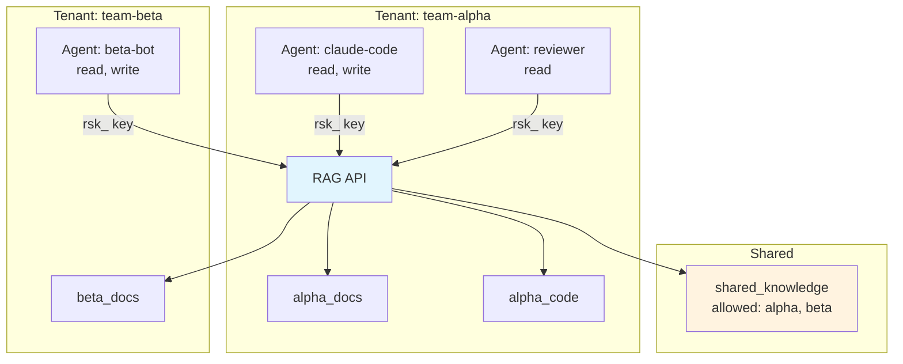

# v2.0 Multi-Agent Hub Implementation Plan

> **For Claude:** REQUIRED SUB-SKILL: Use superpowers:executing-plans to implement this plan task-by-task.

**Goal:** Transform rag-stack from a single-tenant knowledge base into a multi-agent hub with tenant isolation, per-agent API keys, cross-collection search, webhook-driven re-indexing, agent collaboration spaces, observability, and native client SDKs.

**Architecture:** Add a tenant layer that scopes collections per team/project. Replace single bearer token with per-agent API keys stored in a `_auth` Qdrant collection (or SQLite for simplicity). Add cross-collection federated search, webhook endpoints for content sync, shared memory collections, Prometheus metrics, and TypeScript/Python SDK packages.

**Tech Stack:** TypeScript, Fastify, Qdrant, Vitest, prom-client (Prometheus metrics), better-sqlite3 (auth store), undici (webhook delivery)

**Depends on:** v2.0 Knowledge Graph plan must be complete (entity extraction, GraphRAG, enhanced query pipeline).

---

### Task 1: Define multi-tenancy interfaces

**Files:**
- Create: `api/src/interfaces/tenant.ts`
- Create: `api/src/interfaces/tenant.test.ts`

**Step 1: Create the interfaces directory**

```bash
mkdir -p api/src/interfaces
```

Expected: Directory created, no output.

**Step 2: Write the tenant interfaces**

Create `api/src/interfaces/tenant.ts`:

```typescript
export interface Tenant {
  id: string;
  name: string;
  createdAt: string;
  settings: TenantSettings;
}

export interface TenantSettings {
  maxCollections: number;
  maxDocuments: number;
  allowedProviders: string[];
}

export interface ApiKey {
  id: string;
  tenantId: string;
  agentName: string;
  keyHash: string;
  permissions: Permission[];
  createdAt: string;
  lastUsedAt: string | null;
}

export type Permission = "read" | "write" | "admin";

export interface TenantContext {
  tenantId: string;
  agentName: string;
  permissions: Permission[];
}

export interface WebhookRegistration {
  id: string;
  tenantId: string;
  url: string;
  events: WebhookEvent[];
  secret: string;
  createdAt: string;
}

export type WebhookEvent = "content.updated" | "content.deleted" | "collection.created";

export interface CollectionMeta {
  id: string;
  tenantId: string;
  name: string;
  shared: boolean;
  allowedTenants: string[];
  createdAt: string;
}

export interface Job {
  id: string;
  tenantId: string;
  type: JobType;
  status: JobStatus;
  payload: Record<string, unknown>;
  result: Record<string, unknown> | null;
  createdAt: string;
  startedAt: string | null;
  completedAt: string | null;
}

export type JobType = "reindex-repo" | "reindex-url";
export type JobStatus = "pending" | "running" | "completed" | "failed";
```

**Step 3: Write type-level tests**

Create `api/src/interfaces/tenant.test.ts`:

```typescript
import { describe, it, expectTypeOf } from "vitest";
import type {
  Tenant,
  TenantSettings,
  ApiKey,
  Permission,
  TenantContext,
  WebhookRegistration,
  WebhookEvent,
  CollectionMeta,
  Job,
  JobType,
  JobStatus,
} from "./tenant.js";

describe("tenant interfaces", () => {
  it("Tenant has required fields", () => {
    expectTypeOf<Tenant>().toHaveProperty("id");
    expectTypeOf<Tenant>().toHaveProperty("name");
    expectTypeOf<Tenant>().toHaveProperty("createdAt");
    expectTypeOf<Tenant>().toHaveProperty("settings");
    expectTypeOf<Tenant["settings"]>().toEqualTypeOf<TenantSettings>();
  });

  it("TenantSettings has resource limits", () => {
    expectTypeOf<TenantSettings>().toHaveProperty("maxCollections");
    expectTypeOf<TenantSettings["maxCollections"]>().toBeNumber();
    expectTypeOf<TenantSettings>().toHaveProperty("maxDocuments");
    expectTypeOf<TenantSettings["maxDocuments"]>().toBeNumber();
    expectTypeOf<TenantSettings>().toHaveProperty("allowedProviders");
    expectTypeOf<TenantSettings["allowedProviders"]>().toEqualTypeOf<string[]>();
  });

  it("ApiKey has required fields", () => {
    expectTypeOf<ApiKey>().toHaveProperty("id");
    expectTypeOf<ApiKey>().toHaveProperty("tenantId");
    expectTypeOf<ApiKey>().toHaveProperty("agentName");
    expectTypeOf<ApiKey>().toHaveProperty("keyHash");
    expectTypeOf<ApiKey>().toHaveProperty("permissions");
    expectTypeOf<ApiKey["permissions"]>().toEqualTypeOf<Permission[]>();
    expectTypeOf<ApiKey>().toHaveProperty("lastUsedAt");
    expectTypeOf<ApiKey["lastUsedAt"]>().toEqualTypeOf<string | null>();
  });

  it("Permission is a union of read, write, admin", () => {
    expectTypeOf<"read">().toMatchTypeOf<Permission>();
    expectTypeOf<"write">().toMatchTypeOf<Permission>();
    expectTypeOf<"admin">().toMatchTypeOf<Permission>();
  });

  it("TenantContext carries request-scoped tenant info", () => {
    expectTypeOf<TenantContext>().toHaveProperty("tenantId");
    expectTypeOf<TenantContext>().toHaveProperty("agentName");
    expectTypeOf<TenantContext>().toHaveProperty("permissions");
  });

  it("WebhookRegistration has required fields", () => {
    expectTypeOf<WebhookRegistration>().toHaveProperty("id");
    expectTypeOf<WebhookRegistration>().toHaveProperty("tenantId");
    expectTypeOf<WebhookRegistration>().toHaveProperty("url");
    expectTypeOf<WebhookRegistration>().toHaveProperty("events");
    expectTypeOf<WebhookRegistration["events"]>().toEqualTypeOf<WebhookEvent[]>();
    expectTypeOf<WebhookRegistration>().toHaveProperty("secret");
  });

  it("CollectionMeta tracks sharing config", () => {
    expectTypeOf<CollectionMeta>().toHaveProperty("shared");
    expectTypeOf<CollectionMeta["shared"]>().toBeBoolean();
    expectTypeOf<CollectionMeta>().toHaveProperty("allowedTenants");
    expectTypeOf<CollectionMeta["allowedTenants"]>().toEqualTypeOf<string[]>();
  });

  it("Job tracks async processing", () => {
    expectTypeOf<Job>().toHaveProperty("id");
    expectTypeOf<Job>().toHaveProperty("type");
    expectTypeOf<Job["type"]>().toEqualTypeOf<JobType>();
    expectTypeOf<Job>().toHaveProperty("status");
    expectTypeOf<Job["status"]>().toEqualTypeOf<JobStatus>();
    expectTypeOf<Job>().toHaveProperty("result");
    expectTypeOf<Job["result"]>().toEqualTypeOf<Record<string, unknown> | null>();
  });
});
```

**Step 4: Run type tests**

```bash
cd api && npx vitest run src/interfaces/tenant.test.ts
```

Expected: All type tests pass.

**Step 5: Commit**

```bash
git add api/src/interfaces/tenant.ts api/src/interfaces/tenant.test.ts
git commit -m "feat: define multi-tenancy interfaces for tenant, API key, webhook, and job types"
```

---

### Task 2: Implement SQLite auth store

**Files:**
- Create: `api/src/auth/auth-store.ts`
- Create: `api/src/auth/auth-store.test.ts`

**Step 1: Add better-sqlite3 dependency**

```bash
cd api && npm install better-sqlite3 && npm install -D @types/better-sqlite3
```

Expected: `better-sqlite3` added to `dependencies`, `@types/better-sqlite3` added to `devDependencies`.

**Step 2: Write the auth store**

Create `api/src/auth/auth-store.ts`:

```typescript
import Database from "better-sqlite3";
import { createHash, randomBytes, randomUUID } from "node:crypto";
import type {
  Tenant,
  TenantSettings,
  ApiKey,
  Permission,
} from "../interfaces/tenant.js";

export interface AuthStore {
  createTenant(name: string, settings?: Partial<TenantSettings>): Tenant;
  getTenant(id: string): Tenant | null;
  listTenants(): Tenant[];
  createApiKey(
    tenantId: string,
    agentName: string,
    permissions: Permission[]
  ): { apiKey: ApiKey; rawKey: string };
  validateApiKey(rawKey: string): ApiKey | null;
  revokeApiKey(keyId: string): boolean;
  listKeys(tenantId: string): ApiKey[];
  updateLastUsed(keyId: string): void;
  close(): void;
}

const DEFAULT_SETTINGS: TenantSettings = {
  maxCollections: 50,
  maxDocuments: 100000,
  allowedProviders: ["ollama", "openai"],
};

function hashKey(raw: string): string {
  return createHash("sha256").update(raw).digest("hex");
}

function generateRawKey(tenantId: string): string {
  const rand = randomBytes(24).toString("base64url");
  return `rsk_${tenantId}_${rand}`;
}

export function createAuthStore(dbPath: string = ":memory:"): AuthStore {
  const db = new Database(dbPath);
  db.pragma("journal_mode = WAL");
  db.pragma("foreign_keys = ON");

  db.exec(`
    CREATE TABLE IF NOT EXISTS tenants (
      id TEXT PRIMARY KEY,
      name TEXT NOT NULL UNIQUE,
      created_at TEXT NOT NULL,
      max_collections INTEGER NOT NULL DEFAULT 50,
      max_documents INTEGER NOT NULL DEFAULT 100000,
      allowed_providers TEXT NOT NULL DEFAULT '["ollama","openai"]'
    );

    CREATE TABLE IF NOT EXISTS api_keys (
      id TEXT PRIMARY KEY,
      tenant_id TEXT NOT NULL REFERENCES tenants(id) ON DELETE CASCADE,
      agent_name TEXT NOT NULL,
      key_hash TEXT NOT NULL UNIQUE,
      permissions TEXT NOT NULL,
      created_at TEXT NOT NULL,
      last_used_at TEXT
    );

    CREATE INDEX IF NOT EXISTS idx_api_keys_tenant
      ON api_keys(tenant_id);
    CREATE INDEX IF NOT EXISTS idx_api_keys_hash
      ON api_keys(key_hash);
  `);

  const insertTenant = db.prepare(
    `INSERT INTO tenants
       (id, name, created_at, max_collections, max_documents, allowed_providers)
     VALUES (?, ?, ?, ?, ?, ?)`
  );
  const selectTenantById = db.prepare("SELECT * FROM tenants WHERE id = ?");
  const selectAllTenants = db.prepare(
    "SELECT * FROM tenants ORDER BY created_at"
  );
  const insertKey = db.prepare(
    `INSERT INTO api_keys
       (id, tenant_id, agent_name, key_hash, permissions, created_at)
     VALUES (?, ?, ?, ?, ?, ?)`
  );
  const selectKeyByHash = db.prepare(
    "SELECT * FROM api_keys WHERE key_hash = ?"
  );
  const deleteKey = db.prepare("DELETE FROM api_keys WHERE id = ?");
  const selectKeysByTenant = db.prepare(
    "SELECT * FROM api_keys WHERE tenant_id = ? ORDER BY created_at"
  );
  const updateKeyLastUsed = db.prepare(
    "UPDATE api_keys SET last_used_at = ? WHERE id = ?"
  );

  function rowToTenant(row: Record<string, unknown>): Tenant {
    return {
      id: row.id as string,
      name: row.name as string,
      createdAt: row.created_at as string,
      settings: {
        maxCollections: row.max_collections as number,
        maxDocuments: row.max_documents as number,
        allowedProviders: JSON.parse(
          row.allowed_providers as string
        ) as string[],
      },
    };
  }

  function rowToApiKey(row: Record<string, unknown>): ApiKey {
    return {
      id: row.id as string,
      tenantId: row.tenant_id as string,
      agentName: row.agent_name as string,
      keyHash: row.key_hash as string,
      permissions: JSON.parse(row.permissions as string) as Permission[],
      createdAt: row.created_at as string,
      lastUsedAt: (row.last_used_at as string) ?? null,
    };
  }

  return {
    createTenant(
      name: string,
      settings?: Partial<TenantSettings>
    ): Tenant {
      const id = randomUUID();
      const now = new Date().toISOString();
      const merged = { ...DEFAULT_SETTINGS, ...settings };
      insertTenant.run(
        id,
        name,
        now,
        merged.maxCollections,
        merged.maxDocuments,
        JSON.stringify(merged.allowedProviders)
      );
      return { id, name, createdAt: now, settings: merged };
    },

    getTenant(id: string): Tenant | null {
      const row = selectTenantById.get(id) as
        | Record<string, unknown>
        | undefined;
      return row ? rowToTenant(row) : null;
    },

    listTenants(): Tenant[] {
      const rows = selectAllTenants.all() as Record<string, unknown>[];
      return rows.map(rowToTenant);
    },

    createApiKey(
      tenantId: string,
      agentName: string,
      permissions: Permission[]
    ): { apiKey: ApiKey; rawKey: string } {
      const tenant = selectTenantById.get(tenantId) as
        | Record<string, unknown>
        | undefined;
      if (!tenant) throw new Error(`Tenant not found: ${tenantId}`);

      const id = randomUUID();
      const rawKey = generateRawKey(tenantId);
      const kHash = hashKey(rawKey);
      const now = new Date().toISOString();

      insertKey.run(
        id,
        tenantId,
        agentName,
        kHash,
        JSON.stringify(permissions),
        now
      );

      const apiKey: ApiKey = {
        id,
        tenantId,
        agentName,
        keyHash: kHash,
        permissions,
        createdAt: now,
        lastUsedAt: null,
      };

      return { apiKey, rawKey };
    },

    validateApiKey(rawKey: string): ApiKey | null {
      const kHash = hashKey(rawKey);
      const row = selectKeyByHash.get(kHash) as
        | Record<string, unknown>
        | undefined;
      return row ? rowToApiKey(row) : null;
    },

    revokeApiKey(keyId: string): boolean {
      const result = deleteKey.run(keyId);
      return result.changes > 0;
    },

    listKeys(tenantId: string): ApiKey[] {
      const rows = selectKeysByTenant.all(tenantId) as Record<
        string,
        unknown
      >[];
      return rows.map(rowToApiKey);
    },

    updateLastUsed(keyId: string): void {
      updateKeyLastUsed.run(new Date().toISOString(), keyId);
    },

    close(): void {
      db.close();
    },
  };
}
```

**Step 3: Write unit tests**

Create `api/src/auth/auth-store.test.ts`:

```typescript
import { describe, it, expect, beforeEach, afterEach } from "vitest";
import { createAuthStore, type AuthStore } from "./auth-store.js";

describe("AuthStore", () => {
  let store: AuthStore;

  beforeEach(() => {
    store = createAuthStore(":memory:");
  });

  afterEach(() => {
    store.close();
  });

  describe("createTenant", () => {
    it("creates a tenant with default settings", () => {
      const tenant = store.createTenant("team-alpha");
      expect(tenant.id).toBeTruthy();
      expect(tenant.name).toBe("team-alpha");
      expect(tenant.createdAt).toBeTruthy();
      expect(tenant.settings.maxCollections).toBe(50);
      expect(tenant.settings.maxDocuments).toBe(100000);
      expect(tenant.settings.allowedProviders).toEqual([
        "ollama",
        "openai",
      ]);
    });

    it("creates a tenant with custom settings", () => {
      const tenant = store.createTenant("team-beta", {
        maxCollections: 10,
        maxDocuments: 5000,
      });
      expect(tenant.settings.maxCollections).toBe(10);
      expect(tenant.settings.maxDocuments).toBe(5000);
      expect(tenant.settings.allowedProviders).toEqual([
        "ollama",
        "openai",
      ]);
    });

    it("throws on duplicate tenant name", () => {
      store.createTenant("team-alpha");
      expect(() => store.createTenant("team-alpha")).toThrow();
    });
  });

  describe("getTenant", () => {
    it("returns tenant by id", () => {
      const created = store.createTenant("team-alpha");
      const fetched = store.getTenant(created.id);
      expect(fetched).toEqual(created);
    });

    it("returns null for unknown id", () => {
      expect(store.getTenant("nonexistent")).toBeNull();
    });
  });

  describe("listTenants", () => {
    it("returns all tenants ordered by creation", () => {
      store.createTenant("alpha");
      store.createTenant("beta");
      const tenants = store.listTenants();
      expect(tenants).toHaveLength(2);
      expect(tenants[0].name).toBe("alpha");
      expect(tenants[1].name).toBe("beta");
    });
  });

  describe("createApiKey", () => {
    it("returns a raw key and an ApiKey record", () => {
      const tenant = store.createTenant("team-alpha");
      const { apiKey, rawKey } = store.createApiKey(
        tenant.id,
        "claude-agent",
        ["read", "write"]
      );

      expect(rawKey).toMatch(/^rsk_/);
      expect(rawKey).toContain(tenant.id);
      expect(apiKey.tenantId).toBe(tenant.id);
      expect(apiKey.agentName).toBe("claude-agent");
      expect(apiKey.permissions).toEqual(["read", "write"]);
      expect(apiKey.lastUsedAt).toBeNull();
    });

    it("throws for nonexistent tenant", () => {
      expect(() =>
        store.createApiKey("bad-id", "agent", ["read"])
      ).toThrow("Tenant not found");
    });
  });

  describe("validateApiKey", () => {
    it("validates a correct raw key", () => {
      const tenant = store.createTenant("team-alpha");
      const { rawKey } = store.createApiKey(tenant.id, "agent-1", [
        "read",
      ]);

      const validated = store.validateApiKey(rawKey);
      expect(validated).not.toBeNull();
      expect(validated!.agentName).toBe("agent-1");
      expect(validated!.permissions).toEqual(["read"]);
    });

    it("returns null for invalid key", () => {
      expect(store.validateApiKey("rsk_bad_key")).toBeNull();
    });

    it("returns null for empty string", () => {
      expect(store.validateApiKey("")).toBeNull();
    });
  });

  describe("revokeApiKey", () => {
    it("revokes an existing key", () => {
      const tenant = store.createTenant("team-alpha");
      const { apiKey, rawKey } = store.createApiKey(
        tenant.id,
        "agent-1",
        ["read"]
      );

      expect(store.revokeApiKey(apiKey.id)).toBe(true);
      expect(store.validateApiKey(rawKey)).toBeNull();
    });

    it("returns false for nonexistent key", () => {
      expect(store.revokeApiKey("nonexistent")).toBe(false);
    });
  });

  describe("listKeys", () => {
    it("returns keys for a specific tenant", () => {
      const tenantA = store.createTenant("alpha");
      const tenantB = store.createTenant("beta");

      store.createApiKey(tenantA.id, "agent-a1", ["read"]);
      store.createApiKey(tenantA.id, "agent-a2", ["read", "write"]);
      store.createApiKey(tenantB.id, "agent-b1", ["admin"]);

      const keysA = store.listKeys(tenantA.id);
      expect(keysA).toHaveLength(2);
      expect(keysA[0].agentName).toBe("agent-a1");
      expect(keysA[1].agentName).toBe("agent-a2");

      const keysB = store.listKeys(tenantB.id);
      expect(keysB).toHaveLength(1);
    });
  });

  describe("updateLastUsed", () => {
    it("sets the lastUsedAt timestamp", () => {
      const tenant = store.createTenant("team-alpha");
      const { apiKey, rawKey } = store.createApiKey(
        tenant.id,
        "agent-1",
        ["read"]
      );

      expect(apiKey.lastUsedAt).toBeNull();
      store.updateLastUsed(apiKey.id);

      const validated = store.validateApiKey(rawKey);
      expect(validated!.lastUsedAt).toBeTruthy();
    });
  });
});
```

**Step 4: Run tests**

```bash
cd api && npx vitest run src/auth/auth-store.test.ts
```

Expected: All 12 tests pass.

**Step 5: Commit**

```bash
git add api/src/auth/auth-store.ts api/src/auth/auth-store.test.ts api/package.json api/package-lock.json
git commit -m "feat: implement SQLite auth store with tenant and API key management"
```

---

### Task 3: Refactor auth to support API keys

**Files:**
- Modify: `api/src/auth.ts`
- Create: `api/src/auth.test.ts`

**Step 1: Rewrite auth.ts to support both legacy bearer token and API keys**

Replace the entire contents of `api/src/auth.ts`:

```typescript
import type {
  FastifyInstance,
  FastifyRequest,
  FastifyReply,
} from "fastify";
import type { TenantContext } from "./interfaces/tenant.js";
import type { AuthStore } from "./auth/auth-store.js";

declare module "fastify" {
  interface FastifyRequest {
    tenantContext?: TenantContext;
  }
}

function timingSafeEqual(a: string, b: string): boolean {
  if (a.length !== b.length) return false;
  let out = 0;
  for (let i = 0; i < a.length; i++)
    out |= a.charCodeAt(i) ^ b.charCodeAt(i);
  return out === 0;
}

const UNAUTHENTICATED_PATHS = ["/healthz", "/metrics"];

export interface AuthConfig {
  legacyToken: string;
  authStore: AuthStore | null;
}

export function registerAuth(
  app: FastifyInstance,
  config?: AuthConfig
) {
  const legacyToken =
    config?.legacyToken ?? process.env.RAG_API_TOKEN ?? "";
  const authStore = config?.authStore ?? null;

  if (!legacyToken && !authStore) return;

  app.addHook(
    "onRequest",
    async (req: FastifyRequest, reply: FastifyReply) => {
      if (
        req.method === "GET" &&
        UNAUTHENTICATED_PATHS.some((p) => req.url.startsWith(p))
      ) {
        return;
      }

      const auth = (req.headers["authorization"] || "").toString();
      const prefix = "Bearer ";

      if (!auth.startsWith(prefix)) {
        return reply.code(401).send({ error: "Unauthorized" });
      }

      const token = auth.slice(prefix.length);

      // Try API key first (rsk_ prefix)
      if (authStore && token.startsWith("rsk_")) {
        const apiKey = authStore.validateApiKey(token);
        if (!apiKey) {
          return reply.code(401).send({ error: "Unauthorized" });
        }
        authStore.updateLastUsed(apiKey.id);
        req.tenantContext = {
          tenantId: apiKey.tenantId,
          agentName: apiKey.agentName,
          permissions: apiKey.permissions,
        };
        return;
      }

      // Fall back to legacy bearer token
      if (legacyToken && timingSafeEqual(token, legacyToken)) {
        req.tenantContext = {
          tenantId: "default",
          agentName: "legacy",
          permissions: ["read", "write", "admin"],
        };
        return;
      }

      return reply.code(401).send({ error: "Unauthorized" });
    }
  );
}
```

**Step 2: Write auth tests**

Create `api/src/auth.test.ts`:

```typescript
import { describe, it, expect, beforeEach, afterEach } from "vitest";
import Fastify, { type FastifyInstance } from "fastify";
import { registerAuth } from "./auth.js";
import { createAuthStore, type AuthStore } from "./auth/auth-store.js";

describe("registerAuth", () => {
  let app: FastifyInstance;
  let authStore: AuthStore;

  beforeEach(async () => {
    app = Fastify();
    authStore = createAuthStore(":memory:");
    app.get("/healthz", async () => ({ ok: true }));
    app.get("/metrics", async () => "metrics");
    app.post("/v1/query", async (req) => ({
      ok: true,
      tenant: req.tenantContext?.tenantId,
      agent: req.tenantContext?.agentName,
    }));
  });

  afterEach(async () => {
    await app.close();
    authStore.close();
  });

  it("healthz bypasses auth", async () => {
    registerAuth(app, { legacyToken: "secret", authStore });
    const res = await app.inject({
      method: "GET",
      url: "/healthz",
    });
    expect(res.statusCode).toBe(200);
  });

  it("metrics bypasses auth", async () => {
    registerAuth(app, { legacyToken: "secret", authStore });
    const res = await app.inject({
      method: "GET",
      url: "/metrics",
    });
    expect(res.statusCode).toBe(200);
  });

  it("rejects requests without Authorization header", async () => {
    registerAuth(app, { legacyToken: "secret", authStore });
    const res = await app.inject({
      method: "POST",
      url: "/v1/query",
    });
    expect(res.statusCode).toBe(401);
  });

  it("accepts legacy bearer token", async () => {
    registerAuth(app, { legacyToken: "secret", authStore });
    const res = await app.inject({
      method: "POST",
      url: "/v1/query",
      headers: { authorization: "Bearer secret" },
    });
    expect(res.statusCode).toBe(200);
    expect(res.json().tenant).toBe("default");
    expect(res.json().agent).toBe("legacy");
  });

  it("rejects wrong legacy token", async () => {
    registerAuth(app, { legacyToken: "secret", authStore });
    const res = await app.inject({
      method: "POST",
      url: "/v1/query",
      headers: { authorization: "Bearer wrong" },
    });
    expect(res.statusCode).toBe(401);
  });

  it("accepts valid API key", async () => {
    const tenant = authStore.createTenant("team-alpha");
    const { rawKey } = authStore.createApiKey(tenant.id, "my-agent", [
      "read",
      "write",
    ]);

    registerAuth(app, { legacyToken: "", authStore });
    const res = await app.inject({
      method: "POST",
      url: "/v1/query",
      headers: { authorization: `Bearer ${rawKey}` },
    });
    expect(res.statusCode).toBe(200);
    expect(res.json().tenant).toBe(tenant.id);
    expect(res.json().agent).toBe("my-agent");
  });

  it("rejects invalid API key", async () => {
    registerAuth(app, { legacyToken: "", authStore });
    const res = await app.inject({
      method: "POST",
      url: "/v1/query",
      headers: { authorization: "Bearer rsk_bad_key" },
    });
    expect(res.statusCode).toBe(401);
  });

  it("updates lastUsedAt on API key validation", async () => {
    const tenant = authStore.createTenant("team-alpha");
    const { apiKey, rawKey } = authStore.createApiKey(
      tenant.id,
      "agent",
      ["read"]
    );
    expect(apiKey.lastUsedAt).toBeNull();

    registerAuth(app, { legacyToken: "", authStore });
    await app.inject({
      method: "POST",
      url: "/v1/query",
      headers: { authorization: `Bearer ${rawKey}` },
    });

    const updated = authStore.validateApiKey(rawKey);
    expect(updated!.lastUsedAt).toBeTruthy();
  });

  it("skips all auth when no token and no store", async () => {
    registerAuth(app, { legacyToken: "", authStore: null });
    const res = await app.inject({
      method: "POST",
      url: "/v1/query",
    });
    expect(res.statusCode).toBe(200);
  });
});
```

**Step 3: Run tests**

```bash
cd api && npx vitest run src/auth.test.ts
```

Expected: All 9 tests pass.

**Step 4: Commit**

```bash
git add api/src/auth.ts api/src/auth.test.ts
git commit -m "feat: refactor auth to support both legacy bearer tokens and per-agent API keys"
```

---

### Task 4: Add admin endpoints for tenant management

**Files:**
- Create: `api/src/routes/admin.ts`
- Create: `api/src/routes/admin.test.ts`

**Step 1: Create routes directory**

```bash
mkdir -p api/src/routes
```

**Step 2: Write admin route handlers**

Create `api/src/routes/admin.ts`:

```typescript
import type { FastifyInstance } from "fastify";
import type { AuthStore } from "../auth/auth-store.js";
import type { Permission, TenantSettings } from "../interfaces/tenant.js";

interface AdminRouteOptions {
  authStore: AuthStore;
}

function requireAdmin(
  tenantContext: { permissions: string[] } | undefined
): void {
  if (
    !tenantContext ||
    !tenantContext.permissions.includes("admin")
  ) {
    const err = new Error(
      "Forbidden: admin permission required"
    ) as Error & { statusCode: number };
    err.statusCode = 403;
    throw err;
  }
}

export function registerAdminRoutes(
  app: FastifyInstance,
  opts: AdminRouteOptions
): void {
  const { authStore } = opts;

  app.post("/v1/admin/tenants", {
    schema: {
      body: {
        type: "object",
        required: ["name"],
        properties: {
          name: { type: "string", minLength: 1, maxLength: 128 },
          settings: {
            type: "object",
            properties: {
              maxCollections: { type: "integer", minimum: 1 },
              maxDocuments: { type: "integer", minimum: 1 },
              allowedProviders: {
                type: "array",
                items: { type: "string" },
              },
            },
          },
        },
      },
    },
    handler: async (req) => {
      requireAdmin(req.tenantContext);
      const body = req.body as {
        name: string;
        settings?: Partial<TenantSettings>;
      };
      const tenant = authStore.createTenant(
        body.name,
        body.settings
      );
      return { ok: true, tenant };
    },
  });

  app.get("/v1/admin/tenants", async (req) => {
    requireAdmin(req.tenantContext);
    const tenants = authStore.listTenants();
    return { ok: true, tenants };
  });

  app.post("/v1/admin/tenants/:tenantId/keys", {
    schema: {
      params: {
        type: "object",
        required: ["tenantId"],
        properties: { tenantId: { type: "string" } },
      },
      body: {
        type: "object",
        required: ["agentName", "permissions"],
        properties: {
          agentName: {
            type: "string",
            minLength: 1,
            maxLength: 128,
          },
          permissions: {
            type: "array",
            items: {
              type: "string",
              enum: ["read", "write", "admin"],
            },
            minItems: 1,
          },
        },
      },
    },
    handler: async (req) => {
      requireAdmin(req.tenantContext);
      const { tenantId } = req.params as { tenantId: string };
      const { agentName, permissions } = req.body as {
        agentName: string;
        permissions: Permission[];
      };

      const { apiKey, rawKey } = authStore.createApiKey(
        tenantId,
        agentName,
        permissions
      );
      return { ok: true, apiKey, rawKey };
    },
  });

  app.get("/v1/admin/tenants/:tenantId/keys", {
    schema: {
      params: {
        type: "object",
        required: ["tenantId"],
        properties: { tenantId: { type: "string" } },
      },
    },
    handler: async (req) => {
      requireAdmin(req.tenantContext);
      const { tenantId } = req.params as { tenantId: string };
      const keys = authStore.listKeys(tenantId);
      return { ok: true, keys };
    },
  });

  app.delete("/v1/admin/tenants/:tenantId/keys/:keyId", {
    schema: {
      params: {
        type: "object",
        required: ["tenantId", "keyId"],
        properties: {
          tenantId: { type: "string" },
          keyId: { type: "string" },
        },
      },
    },
    handler: async (req) => {
      requireAdmin(req.tenantContext);
      const { keyId } = req.params as {
        tenantId: string;
        keyId: string;
      };
      const revoked = authStore.revokeApiKey(keyId);
      if (!revoked) {
        return { ok: false, error: "Key not found" };
      }
      return { ok: true };
    },
  });
}
```

**Step 3: Write admin route tests**

Create `api/src/routes/admin.test.ts`:

```typescript
import { describe, it, expect, beforeEach, afterEach } from "vitest";
import Fastify, { type FastifyInstance } from "fastify";
import { registerAuth } from "../auth.js";
import {
  createAuthStore,
  type AuthStore,
} from "../auth/auth-store.js";
import { registerAdminRoutes } from "./admin.js";

describe("admin routes", () => {
  let app: FastifyInstance;
  let authStore: AuthStore;
  let adminKey: string;

  beforeEach(async () => {
    app = Fastify();
    authStore = createAuthStore(":memory:");

    const tenant = authStore.createTenant("system");
    const { rawKey } = authStore.createApiKey(
      tenant.id,
      "admin-agent",
      ["admin"]
    );
    adminKey = rawKey;

    registerAuth(app, { legacyToken: "", authStore });
    registerAdminRoutes(app, { authStore });
  });

  afterEach(async () => {
    await app.close();
    authStore.close();
  });

  function adminHeaders() {
    return { authorization: `Bearer ${adminKey}` };
  }

  describe("POST /v1/admin/tenants", () => {
    it("creates a tenant", async () => {
      const res = await app.inject({
        method: "POST",
        url: "/v1/admin/tenants",
        headers: adminHeaders(),
        payload: { name: "team-alpha" },
      });
      expect(res.statusCode).toBe(200);
      const body = res.json();
      expect(body.ok).toBe(true);
      expect(body.tenant.name).toBe("team-alpha");
      expect(body.tenant.id).toBeTruthy();
    });

    it("rejects non-admin", async () => {
      const tenant = authStore.createTenant("team-x");
      const { rawKey } = authStore.createApiKey(
        tenant.id,
        "reader",
        ["read"]
      );
      const res = await app.inject({
        method: "POST",
        url: "/v1/admin/tenants",
        headers: { authorization: `Bearer ${rawKey}` },
        payload: { name: "new-team" },
      });
      expect(res.statusCode).toBe(403);
    });

    it("validates required name field", async () => {
      const res = await app.inject({
        method: "POST",
        url: "/v1/admin/tenants",
        headers: adminHeaders(),
        payload: {},
      });
      expect(res.statusCode).toBe(400);
    });
  });

  describe("GET /v1/admin/tenants", () => {
    it("lists all tenants", async () => {
      authStore.createTenant("team-a");
      authStore.createTenant("team-b");
      const res = await app.inject({
        method: "GET",
        url: "/v1/admin/tenants",
        headers: adminHeaders(),
      });
      expect(res.statusCode).toBe(200);
      expect(res.json().tenants.length).toBeGreaterThanOrEqual(3);
    });
  });

  describe("POST /v1/admin/tenants/:tenantId/keys", () => {
    it("creates an API key for a tenant", async () => {
      const tenant = authStore.createTenant("team-alpha");
      const res = await app.inject({
        method: "POST",
        url: `/v1/admin/tenants/${tenant.id}/keys`,
        headers: adminHeaders(),
        payload: {
          agentName: "my-agent",
          permissions: ["read", "write"],
        },
      });
      expect(res.statusCode).toBe(200);
      const body = res.json();
      expect(body.ok).toBe(true);
      expect(body.rawKey).toMatch(/^rsk_/);
      expect(body.apiKey.agentName).toBe("my-agent");
    });
  });

  describe("GET /v1/admin/tenants/:tenantId/keys", () => {
    it("lists keys for a tenant", async () => {
      const tenant = authStore.createTenant("team-alpha");
      authStore.createApiKey(tenant.id, "agent-1", ["read"]);
      authStore.createApiKey(tenant.id, "agent-2", ["write"]);

      const res = await app.inject({
        method: "GET",
        url: `/v1/admin/tenants/${tenant.id}/keys`,
        headers: adminHeaders(),
      });
      expect(res.statusCode).toBe(200);
      expect(res.json().keys).toHaveLength(2);
    });
  });

  describe("DELETE /v1/admin/tenants/:tenantId/keys/:keyId", () => {
    it("revokes a key", async () => {
      const tenant = authStore.createTenant("team-alpha");
      const { apiKey, rawKey } = authStore.createApiKey(
        tenant.id,
        "agent-1",
        ["read"]
      );

      const res = await app.inject({
        method: "DELETE",
        url: `/v1/admin/tenants/${tenant.id}/keys/${apiKey.id}`,
        headers: adminHeaders(),
      });
      expect(res.statusCode).toBe(200);
      expect(res.json().ok).toBe(true);
      expect(authStore.validateApiKey(rawKey)).toBeNull();
    });

    it("returns ok false for nonexistent key", async () => {
      const tenant = authStore.createTenant("team-alpha");
      const res = await app.inject({
        method: "DELETE",
        url: `/v1/admin/tenants/${tenant.id}/keys/nonexistent`,
        headers: adminHeaders(),
      });
      expect(res.statusCode).toBe(200);
      expect(res.json().ok).toBe(false);
    });
  });
});
```

**Step 4: Run tests**

```bash
cd api && npx vitest run src/routes/admin.test.ts
```

Expected: All 8 tests pass.

**Step 5: Commit**

```bash
git add api/src/routes/admin.ts api/src/routes/admin.test.ts
git commit -m "feat: add admin endpoints for tenant and API key management"
```

---

### Task 5: Add collection namespacing

**Files:**
- Create: `api/src/services/tenant-scope.ts`
- Create: `api/src/services/tenant-scope.test.ts`

**Step 1: Create services directory**

```bash
mkdir -p api/src/services
```

**Step 2: Write the tenant scope service**

Create `api/src/services/tenant-scope.ts`:

```typescript
import type {
  TenantContext,
  CollectionMeta,
} from "../interfaces/tenant.js";

export function scopedCollectionName(
  tenantId: string,
  collection: string
): string {
  if (tenantId === "default") return collection;
  return `${tenantId}_${collection}`;
}

export function parseScopedName(
  scopedName: string
): { tenantId: string; collection: string } {
  const idx = scopedName.indexOf("_");
  if (idx === -1)
    return { tenantId: "default", collection: scopedName };
  return {
    tenantId: scopedName.slice(0, idx),
    collection: scopedName.slice(idx + 1),
  };
}

export function canAccessCollection(
  context: TenantContext,
  targetTenantId: string,
  collectionMeta: CollectionMeta | null
): boolean {
  if (context.permissions.includes("admin")) return true;
  if (context.tenantId === targetTenantId) return true;
  if (
    collectionMeta?.shared &&
    collectionMeta.allowedTenants.includes(context.tenantId)
  ) {
    return true;
  }
  return false;
}

export function resolveCollection(
  context: TenantContext | undefined,
  requestedCollection: string | undefined,
  defaultCollection: string
): string {
  const collection = requestedCollection || defaultCollection;
  const tenantId = context?.tenantId ?? "default";
  return scopedCollectionName(tenantId, collection);
}
```

**Step 3: Write tests**

Create `api/src/services/tenant-scope.test.ts`:

```typescript
import { describe, it, expect } from "vitest";
import {
  scopedCollectionName,
  parseScopedName,
  canAccessCollection,
  resolveCollection,
} from "./tenant-scope.js";
import type {
  TenantContext,
  CollectionMeta,
} from "../interfaces/tenant.js";

describe("tenant-scope", () => {
  describe("scopedCollectionName", () => {
    it("prefixes with tenant ID", () => {
      expect(scopedCollectionName("abc123", "docs")).toBe(
        "abc123_docs"
      );
    });

    it("returns plain name for default tenant", () => {
      expect(scopedCollectionName("default", "docs")).toBe("docs");
    });
  });

  describe("parseScopedName", () => {
    it("parses a scoped name", () => {
      const result = parseScopedName("abc123_docs");
      expect(result.tenantId).toBe("abc123");
      expect(result.collection).toBe("docs");
    });

    it("handles names with multiple underscores", () => {
      const result = parseScopedName("abc_my_collection");
      expect(result.tenantId).toBe("abc");
      expect(result.collection).toBe("my_collection");
    });

    it("returns default tenant for unscoped names", () => {
      const result = parseScopedName("docs");
      expect(result.tenantId).toBe("default");
      expect(result.collection).toBe("docs");
    });
  });

  describe("canAccessCollection", () => {
    const makeContext = (
      tenantId: string,
      perms: string[]
    ): TenantContext => ({
      tenantId,
      agentName: "test",
      permissions: perms as TenantContext["permissions"],
    });

    it("admin can access any collection", () => {
      const ctx = makeContext("tenant-a", ["admin"]);
      expect(canAccessCollection(ctx, "tenant-b", null)).toBe(
        true
      );
    });

    it("own tenant can access own collection", () => {
      const ctx = makeContext("tenant-a", ["read"]);
      expect(canAccessCollection(ctx, "tenant-a", null)).toBe(
        true
      );
    });

    it("other tenant cannot access non-shared collection", () => {
      const ctx = makeContext("tenant-a", ["read"]);
      expect(canAccessCollection(ctx, "tenant-b", null)).toBe(
        false
      );
    });

    it("allowed tenant can access shared collection", () => {
      const ctx = makeContext("tenant-a", ["read"]);
      const meta: CollectionMeta = {
        id: "1",
        tenantId: "tenant-b",
        name: "shared-docs",
        shared: true,
        allowedTenants: ["tenant-a", "tenant-c"],
        createdAt: new Date().toISOString(),
      };
      expect(canAccessCollection(ctx, "tenant-b", meta)).toBe(
        true
      );
    });

    it("non-allowed tenant cannot access shared collection", () => {
      const ctx = makeContext("tenant-x", ["read"]);
      const meta: CollectionMeta = {
        id: "1",
        tenantId: "tenant-b",
        name: "shared-docs",
        shared: true,
        allowedTenants: ["tenant-a"],
        createdAt: new Date().toISOString(),
      };
      expect(canAccessCollection(ctx, "tenant-b", meta)).toBe(
        false
      );
    });
  });

  describe("resolveCollection", () => {
    it("scopes collection to tenant", () => {
      const ctx: TenantContext = {
        tenantId: "abc123",
        agentName: "agent",
        permissions: ["read"],
      };
      expect(resolveCollection(ctx, "docs", "default-docs")).toBe(
        "abc123_docs"
      );
    });

    it("uses default collection when none specified", () => {
      const ctx: TenantContext = {
        tenantId: "abc123",
        agentName: "agent",
        permissions: ["read"],
      };
      expect(
        resolveCollection(ctx, undefined, "default-docs")
      ).toBe("abc123_default-docs");
    });

    it("returns unscoped for undefined context", () => {
      expect(resolveCollection(undefined, "docs", "docs")).toBe(
        "docs"
      );
    });
  });
});
```

**Step 4: Run tests**

```bash
cd api && npx vitest run src/services/tenant-scope.test.ts
```

Expected: All 10 tests pass.

**Step 5: Commit**

```bash
git add api/src/services/tenant-scope.ts api/src/services/tenant-scope.test.ts
git commit -m "feat: add collection namespacing with tenant scoping and shared collection access"
```

---

### Task 6: Cross-collection federated search

**Files:**
- Create: `api/src/services/federated-search.ts`
- Create: `api/src/services/federated-search.test.ts`

**Step 1: Write the federated search service**

Create `api/src/services/federated-search.ts`:

```typescript
import type { QdrantClient } from "@qdrant/js-client-rest";

export interface SearchResult {
  id: string | number;
  score: number;
  source: string;
  text: string;
  collection: string;
  payload: Record<string, unknown>;
}

export interface FederatedSearchOptions {
  collections: string[];
  vector: number[];
  topK: number;
  filter?: Record<string, unknown>;
}

export async function federatedSearch(
  qdrant: QdrantClient,
  opts: FederatedSearchOptions
): Promise<SearchResult[]> {
  const { collections, vector, topK, filter } = opts;

  const searches = collections.map(async (collection) => {
    try {
      const results = await qdrant.search(collection, {
        vector,
        limit: topK,
        with_payload: true,
        filter: filter as Record<string, unknown> | undefined,
      });

      return (results ?? []).map(
        (r: Record<string, unknown>): SearchResult => ({
          id: r.id as string | number,
          score: r.score as number,
          source: (
            r.payload as Record<string, unknown> | undefined
          )?.source as string,
          text: (
            r.payload as Record<string, unknown> | undefined
          )?.text as string,
          collection,
          payload: (r.payload as Record<string, unknown>) ?? {},
        })
      );
    } catch {
      // Collection may not exist; return empty
      return [];
    }
  });

  const allResults = (await Promise.all(searches)).flat();

  // Sort by score descending, take topK
  allResults.sort((a, b) => b.score - a.score);
  return allResults.slice(0, topK);
}
```

**Step 2: Write tests**

Create `api/src/services/federated-search.test.ts`:

```typescript
import { describe, it, expect, vi } from "vitest";
import { federatedSearch } from "./federated-search.js";

function mockQdrant(
  data: Record<string, Array<{ id: string; score: number; payload: Record<string, unknown> }>>
) {
  return {
    search: vi.fn(
      async (
        collection: string
      ) => {
        return data[collection] ?? [];
      }
    ),
  } as unknown as import("@qdrant/js-client-rest").QdrantClient;
}

describe("federatedSearch", () => {
  it("searches a single collection (backward compat)", async () => {
    const qdrant = mockQdrant({
      docs: [
        {
          id: "a",
          score: 0.9,
          payload: { text: "hello", source: "src.ts" },
        },
      ],
    });

    const results = await federatedSearch(qdrant, {
      collections: ["docs"],
      vector: [0.1, 0.2],
      topK: 5,
    });

    expect(results).toHaveLength(1);
    expect(results[0].id).toBe("a");
    expect(results[0].collection).toBe("docs");
    expect(results[0].score).toBe(0.9);
  });

  it("merges results from multiple collections by score", async () => {
    const qdrant = mockQdrant({
      "tenant-a_docs": [
        {
          id: "a1",
          score: 0.95,
          payload: { text: "top", source: "a.ts" },
        },
        {
          id: "a2",
          score: 0.7,
          payload: { text: "low", source: "a2.ts" },
        },
      ],
      "tenant-a_code": [
        {
          id: "c1",
          score: 0.85,
          payload: { text: "mid", source: "c.ts" },
        },
      ],
    });

    const results = await federatedSearch(qdrant, {
      collections: ["tenant-a_docs", "tenant-a_code"],
      vector: [0.1, 0.2],
      topK: 10,
    });

    expect(results).toHaveLength(3);
    expect(results[0].id).toBe("a1");
    expect(results[0].score).toBe(0.95);
    expect(results[1].id).toBe("c1");
    expect(results[1].collection).toBe("tenant-a_code");
    expect(results[2].id).toBe("a2");
  });

  it("respects topK limit across collections", async () => {
    const qdrant = mockQdrant({
      col1: [
        {
          id: "1",
          score: 0.9,
          payload: { text: "a", source: "a" },
        },
        {
          id: "2",
          score: 0.8,
          payload: { text: "b", source: "b" },
        },
      ],
      col2: [
        {
          id: "3",
          score: 0.85,
          payload: { text: "c", source: "c" },
        },
        {
          id: "4",
          score: 0.7,
          payload: { text: "d", source: "d" },
        },
      ],
    });

    const results = await federatedSearch(qdrant, {
      collections: ["col1", "col2"],
      vector: [0.1],
      topK: 2,
    });

    expect(results).toHaveLength(2);
    expect(results[0].score).toBe(0.9);
    expect(results[1].score).toBe(0.85);
  });

  it("returns empty array for no results", async () => {
    const qdrant = mockQdrant({});

    const results = await federatedSearch(qdrant, {
      collections: ["nonexistent"],
      vector: [0.1],
      topK: 5,
    });

    expect(results).toEqual([]);
  });

  it("handles collection errors gracefully", async () => {
    const qdrant = {
      search: vi.fn(async (collection: string) => {
        if (collection === "bad") throw new Error("not found");
        return [
          {
            id: "ok",
            score: 0.8,
            payload: { text: "works", source: "s" },
          },
        ];
      }),
    } as unknown as import("@qdrant/js-client-rest").QdrantClient;

    const results = await federatedSearch(qdrant, {
      collections: ["bad", "good"],
      vector: [0.1],
      topK: 5,
    });

    expect(results).toHaveLength(1);
    expect(results[0].id).toBe("ok");
  });
});
```

**Step 3: Run tests**

```bash
cd api && npx vitest run src/services/federated-search.test.ts
```

Expected: All 5 tests pass.

**Step 4: Commit**

```bash
git add api/src/services/federated-search.ts api/src/services/federated-search.test.ts
git commit -m "feat: add cross-collection federated search with score-based merging"
```

---

### Task 7: Webhook registration and triggering

**Files:**
- Create: `api/src/services/webhook.ts`
- Create: `api/src/services/webhook.test.ts`

**Step 1: Write the webhook service**

Create `api/src/services/webhook.ts`:

```typescript
import Database from "better-sqlite3";
import { createHmac, randomUUID } from "node:crypto";
import type {
  WebhookRegistration,
  WebhookEvent,
} from "../interfaces/tenant.js";

export interface WebhookStore {
  register(
    tenantId: string,
    url: string,
    events: WebhookEvent[],
    secret: string
  ): WebhookRegistration;
  list(tenantId: string): WebhookRegistration[];
  remove(id: string): boolean;
  findByEvent(
    tenantId: string,
    event: WebhookEvent
  ): WebhookRegistration[];
  close(): void;
}

export function verifySignature(
  payload: string,
  secret: string,
  signature: string
): boolean {
  const expected = createHmac("sha256", secret)
    .update(payload)
    .digest("hex");
  if (expected.length !== signature.length) return false;
  let mismatch = 0;
  for (let i = 0; i < expected.length; i++) {
    mismatch |= expected.charCodeAt(i) ^ signature.charCodeAt(i);
  }
  return mismatch === 0;
}

export function createSignature(
  payload: string,
  secret: string
): string {
  return createHmac("sha256", secret)
    .update(payload)
    .digest("hex");
}

export function createWebhookStore(db: Database.Database): WebhookStore {
  db.exec(`
    CREATE TABLE IF NOT EXISTS webhook_registrations (
      id TEXT PRIMARY KEY,
      tenant_id TEXT NOT NULL,
      url TEXT NOT NULL,
      events TEXT NOT NULL,
      secret TEXT NOT NULL,
      created_at TEXT NOT NULL
    );

    CREATE INDEX IF NOT EXISTS idx_webhooks_tenant
      ON webhook_registrations(tenant_id);
  `);

  const insertStmt = db.prepare(
    `INSERT INTO webhook_registrations
       (id, tenant_id, url, events, secret, created_at)
     VALUES (?, ?, ?, ?, ?, ?)`
  );
  const selectByTenant = db.prepare(
    "SELECT * FROM webhook_registrations WHERE tenant_id = ? ORDER BY created_at"
  );
  const deleteStmt = db.prepare(
    "DELETE FROM webhook_registrations WHERE id = ?"
  );
  const selectByTenantEvent = db.prepare(
    "SELECT * FROM webhook_registrations WHERE tenant_id = ?"
  );

  function rowToWebhook(
    row: Record<string, unknown>
  ): WebhookRegistration {
    return {
      id: row.id as string,
      tenantId: row.tenant_id as string,
      url: row.url as string,
      events: JSON.parse(row.events as string) as WebhookEvent[],
      secret: row.secret as string,
      createdAt: row.created_at as string,
    };
  }

  return {
    register(
      tenantId: string,
      url: string,
      events: WebhookEvent[],
      secret: string
    ): WebhookRegistration {
      const id = randomUUID();
      const now = new Date().toISOString();
      insertStmt.run(
        id,
        tenantId,
        url,
        JSON.stringify(events),
        secret,
        now
      );
      return { id, tenantId, url, events, secret, createdAt: now };
    },

    list(tenantId: string): WebhookRegistration[] {
      const rows = selectByTenant.all(tenantId) as Record<
        string,
        unknown
      >[];
      return rows.map(rowToWebhook);
    },

    remove(id: string): boolean {
      return deleteStmt.run(id).changes > 0;
    },

    findByEvent(
      tenantId: string,
      event: WebhookEvent
    ): WebhookRegistration[] {
      const rows = selectByTenantEvent.all(tenantId) as Record<
        string,
        unknown
      >[];
      return rows
        .map(rowToWebhook)
        .filter((w) => w.events.includes(event));
    },

    close(): void {
      // DB lifecycle managed externally
    },
  };
}
```

**Step 2: Write webhook tests**

Create `api/src/services/webhook.test.ts`:

```typescript
import { describe, it, expect, beforeEach, afterEach } from "vitest";
import Database from "better-sqlite3";
import {
  createWebhookStore,
  verifySignature,
  createSignature,
  type WebhookStore,
} from "./webhook.js";

describe("webhook", () => {
  let db: Database.Database;
  let store: WebhookStore;

  beforeEach(() => {
    db = new Database(":memory:");
    store = createWebhookStore(db);
  });

  afterEach(() => {
    db.close();
  });

  describe("register", () => {
    it("creates a webhook registration", () => {
      const wh = store.register(
        "tenant-a",
        "https://example.com/hook",
        ["content.updated"],
        "my-secret"
      );
      expect(wh.id).toBeTruthy();
      expect(wh.tenantId).toBe("tenant-a");
      expect(wh.url).toBe("https://example.com/hook");
      expect(wh.events).toEqual(["content.updated"]);
      expect(wh.secret).toBe("my-secret");
    });
  });

  describe("list", () => {
    it("returns webhooks for a tenant", () => {
      store.register("t1", "https://a.com", ["content.updated"], "s1");
      store.register("t1", "https://b.com", ["content.deleted"], "s2");
      store.register("t2", "https://c.com", ["content.updated"], "s3");

      const t1Hooks = store.list("t1");
      expect(t1Hooks).toHaveLength(2);

      const t2Hooks = store.list("t2");
      expect(t2Hooks).toHaveLength(1);
    });
  });

  describe("remove", () => {
    it("removes a webhook", () => {
      const wh = store.register(
        "t1",
        "https://a.com",
        ["content.updated"],
        "s1"
      );
      expect(store.remove(wh.id)).toBe(true);
      expect(store.list("t1")).toHaveLength(0);
    });

    it("returns false for nonexistent webhook", () => {
      expect(store.remove("nonexistent")).toBe(false);
    });
  });

  describe("findByEvent", () => {
    it("filters by event type", () => {
      store.register(
        "t1",
        "https://a.com",
        ["content.updated"],
        "s1"
      );
      store.register(
        "t1",
        "https://b.com",
        ["content.deleted"],
        "s2"
      );
      store.register(
        "t1",
        "https://c.com",
        ["content.updated", "content.deleted"],
        "s3"
      );

      const updated = store.findByEvent("t1", "content.updated");
      expect(updated).toHaveLength(2);

      const deleted = store.findByEvent("t1", "content.deleted");
      expect(deleted).toHaveLength(2);
    });
  });

  describe("verifySignature", () => {
    it("verifies a valid HMAC signature", () => {
      const payload = '{"event":"content.updated"}';
      const secret = "test-secret";
      const sig = createSignature(payload, secret);
      expect(verifySignature(payload, secret, sig)).toBe(true);
    });

    it("rejects an invalid signature", () => {
      const payload = '{"event":"content.updated"}';
      expect(
        verifySignature(payload, "secret", "bad-signature")
      ).toBe(false);
    });

    it("rejects tampered payload", () => {
      const secret = "test-secret";
      const sig = createSignature("original", secret);
      expect(verifySignature("tampered", secret, sig)).toBe(false);
    });
  });
});
```

**Step 3: Run tests**

```bash
cd api && npx vitest run src/services/webhook.test.ts
```

Expected: All 8 tests pass.

**Step 4: Commit**

```bash
git add api/src/services/webhook.ts api/src/services/webhook.test.ts
git commit -m "feat: add webhook registration, HMAC verification, and SQLite storage"
```

---

### Task 8: Re-index job queue

**Files:**
- Create: `api/src/services/job-queue.ts`
- Create: `api/src/services/job-queue.test.ts`

**Step 1: Write the job queue**

Create `api/src/services/job-queue.ts`:

```typescript
import { randomUUID } from "node:crypto";
import type {
  Job,
  JobType,
  JobStatus,
} from "../interfaces/tenant.js";

export interface JobQueue {
  enqueue(
    tenantId: string,
    type: JobType,
    payload: Record<string, unknown>
  ): Job;
  getJob(id: string): Job | null;
  dequeue(): Job | null;
  complete(id: string, result: Record<string, unknown>): void;
  fail(id: string, error: string): void;
  listByTenant(tenantId: string): Job[];
}

export function createJobQueue(): JobQueue {
  const jobs = new Map<string, Job>();
  const pending: string[] = [];

  return {
    enqueue(
      tenantId: string,
      type: JobType,
      payload: Record<string, unknown>
    ): Job {
      const id = randomUUID();
      const now = new Date().toISOString();
      const job: Job = {
        id,
        tenantId,
        type,
        status: "pending",
        payload,
        result: null,
        createdAt: now,
        startedAt: null,
        completedAt: null,
      };
      jobs.set(id, job);
      pending.push(id);
      return job;
    },

    getJob(id: string): Job | null {
      return jobs.get(id) ?? null;
    },

    dequeue(): Job | null {
      while (pending.length > 0) {
        const id = pending.shift()!;
        const job = jobs.get(id);
        if (job && job.status === "pending") {
          job.status = "running";
          job.startedAt = new Date().toISOString();
          return job;
        }
      }
      return null;
    },

    complete(
      id: string,
      result: Record<string, unknown>
    ): void {
      const job = jobs.get(id);
      if (!job) throw new Error(`Job not found: ${id}`);
      job.status = "completed";
      job.result = result;
      job.completedAt = new Date().toISOString();
    },

    fail(id: string, error: string): void {
      const job = jobs.get(id);
      if (!job) throw new Error(`Job not found: ${id}`);
      job.status = "failed";
      job.result = { error };
      job.completedAt = new Date().toISOString();
    },

    listByTenant(tenantId: string): Job[] {
      return Array.from(jobs.values())
        .filter((j) => j.tenantId === tenantId)
        .sort(
          (a, b) =>
            new Date(b.createdAt).getTime() -
            new Date(a.createdAt).getTime()
        );
    },
  };
}
```

**Step 2: Write tests**

Create `api/src/services/job-queue.test.ts`:

```typescript
import { describe, it, expect, beforeEach } from "vitest";
import { createJobQueue, type JobQueue } from "./job-queue.js";

describe("JobQueue", () => {
  let queue: JobQueue;

  beforeEach(() => {
    queue = createJobQueue();
  });

  describe("enqueue", () => {
    it("creates a pending job", () => {
      const job = queue.enqueue("tenant-a", "reindex-repo", {
        repoUrl: "https://github.com/org/repo",
      });
      expect(job.id).toBeTruthy();
      expect(job.tenantId).toBe("tenant-a");
      expect(job.type).toBe("reindex-repo");
      expect(job.status).toBe("pending");
      expect(job.payload.repoUrl).toBe(
        "https://github.com/org/repo"
      );
      expect(job.result).toBeNull();
      expect(job.startedAt).toBeNull();
    });
  });

  describe("getJob", () => {
    it("retrieves a job by id", () => {
      const job = queue.enqueue("t1", "reindex-repo", {});
      const fetched = queue.getJob(job.id);
      expect(fetched).toEqual(job);
    });

    it("returns null for unknown id", () => {
      expect(queue.getJob("nonexistent")).toBeNull();
    });
  });

  describe("dequeue", () => {
    it("returns the next pending job and marks it running", () => {
      queue.enqueue("t1", "reindex-repo", { order: 1 });
      queue.enqueue("t1", "reindex-url", { order: 2 });

      const job = queue.dequeue();
      expect(job).not.toBeNull();
      expect(job!.status).toBe("running");
      expect(job!.startedAt).toBeTruthy();
      expect(job!.payload.order).toBe(1);
    });

    it("returns null when queue is empty", () => {
      expect(queue.dequeue()).toBeNull();
    });
  });

  describe("complete", () => {
    it("marks a job as completed with result", () => {
      const job = queue.enqueue("t1", "reindex-repo", {});
      queue.dequeue(); // mark running
      queue.complete(job.id, { indexed: 42 });

      const updated = queue.getJob(job.id);
      expect(updated!.status).toBe("completed");
      expect(updated!.result).toEqual({ indexed: 42 });
      expect(updated!.completedAt).toBeTruthy();
    });

    it("throws for unknown job id", () => {
      expect(() => queue.complete("bad", {})).toThrow(
        "Job not found"
      );
    });
  });

  describe("fail", () => {
    it("marks a job as failed with error", () => {
      const job = queue.enqueue("t1", "reindex-repo", {});
      queue.dequeue();
      queue.fail(job.id, "clone failed");

      const updated = queue.getJob(job.id);
      expect(updated!.status).toBe("failed");
      expect(updated!.result).toEqual({ error: "clone failed" });
      expect(updated!.completedAt).toBeTruthy();
    });
  });

  describe("listByTenant", () => {
    it("returns jobs for a specific tenant", () => {
      queue.enqueue("t1", "reindex-repo", {});
      queue.enqueue("t2", "reindex-repo", {});
      queue.enqueue("t1", "reindex-url", {});

      const t1Jobs = queue.listByTenant("t1");
      expect(t1Jobs).toHaveLength(2);

      const t2Jobs = queue.listByTenant("t2");
      expect(t2Jobs).toHaveLength(1);
    });
  });
});
```

**Step 3: Run tests**

```bash
cd api && npx vitest run src/services/job-queue.test.ts
```

Expected: All 8 tests pass.

**Step 4: Commit**

```bash
git add api/src/services/job-queue.ts api/src/services/job-queue.test.ts
git commit -m "feat: add in-process FIFO job queue for re-index operations"
```

---

### Task 9: Shared memory collections

**Files:**
- Create: `api/src/services/collection-store.ts`
- Create: `api/src/services/collection-store.test.ts`

**Step 1: Write the collection metadata store**

Create `api/src/services/collection-store.ts`:

```typescript
import Database from "better-sqlite3";
import { randomUUID } from "node:crypto";
import type { CollectionMeta } from "../interfaces/tenant.js";

export interface CollectionStore {
  create(
    tenantId: string,
    name: string,
    shared?: boolean,
    allowedTenants?: string[]
  ): CollectionMeta;
  get(tenantId: string, name: string): CollectionMeta | null;
  listByTenant(tenantId: string): CollectionMeta[];
  updateSharing(
    id: string,
    shared: boolean,
    allowedTenants: string[]
  ): void;
  remove(id: string): boolean;
  close(): void;
}

export function createCollectionStore(
  db: Database.Database
): CollectionStore {
  db.exec(`
    CREATE TABLE IF NOT EXISTS collections (
      id TEXT PRIMARY KEY,
      tenant_id TEXT NOT NULL,
      name TEXT NOT NULL,
      shared INTEGER NOT NULL DEFAULT 0,
      allowed_tenants TEXT NOT NULL DEFAULT '[]',
      created_at TEXT NOT NULL,
      UNIQUE(tenant_id, name)
    );

    CREATE INDEX IF NOT EXISTS idx_collections_tenant
      ON collections(tenant_id);
  `);

  const insertStmt = db.prepare(
    `INSERT INTO collections
       (id, tenant_id, name, shared, allowed_tenants, created_at)
     VALUES (?, ?, ?, ?, ?, ?)`
  );
  const selectByTenantName = db.prepare(
    "SELECT * FROM collections WHERE tenant_id = ? AND name = ?"
  );
  const selectByTenant = db.prepare(
    "SELECT * FROM collections WHERE tenant_id = ? ORDER BY created_at"
  );
  const updateSharingStmt = db.prepare(
    "UPDATE collections SET shared = ?, allowed_tenants = ? WHERE id = ?"
  );
  const deleteStmt = db.prepare(
    "DELETE FROM collections WHERE id = ?"
  );

  function rowToMeta(row: Record<string, unknown>): CollectionMeta {
    return {
      id: row.id as string,
      tenantId: row.tenant_id as string,
      name: row.name as string,
      shared: (row.shared as number) === 1,
      allowedTenants: JSON.parse(
        row.allowed_tenants as string
      ) as string[],
      createdAt: row.created_at as string,
    };
  }

  return {
    create(
      tenantId: string,
      name: string,
      shared = false,
      allowedTenants: string[] = []
    ): CollectionMeta {
      const id = randomUUID();
      const now = new Date().toISOString();
      insertStmt.run(
        id,
        tenantId,
        name,
        shared ? 1 : 0,
        JSON.stringify(allowedTenants),
        now
      );
      return {
        id,
        tenantId,
        name,
        shared,
        allowedTenants,
        createdAt: now,
      };
    },

    get(
      tenantId: string,
      name: string
    ): CollectionMeta | null {
      const row = selectByTenantName.get(tenantId, name) as
        | Record<string, unknown>
        | undefined;
      return row ? rowToMeta(row) : null;
    },

    listByTenant(tenantId: string): CollectionMeta[] {
      const rows = selectByTenant.all(tenantId) as Record<
        string,
        unknown
      >[];
      return rows.map(rowToMeta);
    },

    updateSharing(
      id: string,
      shared: boolean,
      allowedTenants: string[]
    ): void {
      updateSharingStmt.run(
        shared ? 1 : 0,
        JSON.stringify(allowedTenants),
        id
      );
    },

    remove(id: string): boolean {
      return deleteStmt.run(id).changes > 0;
    },

    close(): void {
      // DB lifecycle managed externally
    },
  };
}
```

**Step 2: Write tests**

Create `api/src/services/collection-store.test.ts`:

```typescript
import { describe, it, expect, beforeEach, afterEach } from "vitest";
import Database from "better-sqlite3";
import {
  createCollectionStore,
  type CollectionStore,
} from "./collection-store.js";

describe("CollectionStore", () => {
  let db: Database.Database;
  let store: CollectionStore;

  beforeEach(() => {
    db = new Database(":memory:");
    store = createCollectionStore(db);
  });

  afterEach(() => {
    db.close();
  });

  describe("create", () => {
    it("creates a private collection", () => {
      const col = store.create("tenant-a", "docs");
      expect(col.id).toBeTruthy();
      expect(col.tenantId).toBe("tenant-a");
      expect(col.name).toBe("docs");
      expect(col.shared).toBe(false);
      expect(col.allowedTenants).toEqual([]);
    });

    it("creates a shared collection", () => {
      const col = store.create("tenant-a", "shared-kb", true, [
        "tenant-b",
        "tenant-c",
      ]);
      expect(col.shared).toBe(true);
      expect(col.allowedTenants).toEqual([
        "tenant-b",
        "tenant-c",
      ]);
    });

    it("throws on duplicate tenant+name", () => {
      store.create("tenant-a", "docs");
      expect(() => store.create("tenant-a", "docs")).toThrow();
    });
  });

  describe("get", () => {
    it("retrieves collection metadata", () => {
      const created = store.create("tenant-a", "docs");
      const fetched = store.get("tenant-a", "docs");
      expect(fetched).toEqual(created);
    });

    it("returns null for nonexistent collection", () => {
      expect(store.get("tenant-a", "nope")).toBeNull();
    });
  });

  describe("listByTenant", () => {
    it("returns collections for a tenant", () => {
      store.create("tenant-a", "docs");
      store.create("tenant-a", "code");
      store.create("tenant-b", "docs");

      const a = store.listByTenant("tenant-a");
      expect(a).toHaveLength(2);

      const b = store.listByTenant("tenant-b");
      expect(b).toHaveLength(1);
    });
  });

  describe("updateSharing", () => {
    it("makes a private collection shared", () => {
      const col = store.create("tenant-a", "docs");
      store.updateSharing(col.id, true, ["tenant-b"]);

      const updated = store.get("tenant-a", "docs");
      expect(updated!.shared).toBe(true);
      expect(updated!.allowedTenants).toEqual(["tenant-b"]);
    });

    it("updates the allowed tenants list", () => {
      const col = store.create("tenant-a", "docs", true, [
        "tenant-b",
      ]);
      store.updateSharing(col.id, true, [
        "tenant-b",
        "tenant-c",
      ]);

      const updated = store.get("tenant-a", "docs");
      expect(updated!.allowedTenants).toEqual([
        "tenant-b",
        "tenant-c",
      ]);
    });
  });

  describe("remove", () => {
    it("removes a collection", () => {
      const col = store.create("tenant-a", "docs");
      expect(store.remove(col.id)).toBe(true);
      expect(store.get("tenant-a", "docs")).toBeNull();
    });

    it("returns false for nonexistent", () => {
      expect(store.remove("bad-id")).toBe(false);
    });
  });
});
```

**Step 3: Run tests**

```bash
cd api && npx vitest run src/services/collection-store.test.ts
```

Expected: All 9 tests pass.

**Step 4: Commit**

```bash
git add api/src/services/collection-store.ts api/src/services/collection-store.test.ts
git commit -m "feat: add shared memory collections with SQLite metadata store"
```

---

### Task 10: Prometheus metrics

**Files:**
- Create: `api/src/metrics.ts`
- Create: `api/src/metrics.test.ts`

**Step 1: Add prom-client dependency**

```bash
cd api && npm install prom-client
```

Expected: `prom-client` added to `dependencies`.

**Step 2: Write the metrics module**

Create `api/src/metrics.ts`:

```typescript
import {
  Registry,
  Counter,
  Histogram,
  Gauge,
  collectDefaultMetrics,
} from "prom-client";
import type { FastifyInstance } from "fastify";

export interface Metrics {
  ingestTotal: Counter;
  queryTotal: Counter;
  queryDuration: Histogram;
  embeddingDuration: Histogram;
  activeTenants: Gauge;
  collectionsTotal: Gauge;
  registry: Registry;
}

export function createMetrics(): Metrics {
  const registry = new Registry();
  collectDefaultMetrics({ register: registry });

  const ingestTotal = new Counter({
    name: "rag_ingest_total",
    help: "Total number of ingest operations",
    labelNames: ["tenant_id"],
    registers: [registry],
  });

  const queryTotal = new Counter({
    name: "rag_query_total",
    help: "Total number of query operations",
    labelNames: ["tenant_id"],
    registers: [registry],
  });

  const queryDuration = new Histogram({
    name: "rag_query_duration_seconds",
    help: "Query latency in seconds",
    labelNames: ["tenant_id"],
    buckets: [0.01, 0.05, 0.1, 0.25, 0.5, 1, 2.5, 5, 10],
    registers: [registry],
  });

  const embeddingDuration = new Histogram({
    name: "rag_embedding_duration_seconds",
    help: "Embedding generation latency in seconds",
    labelNames: ["provider"],
    buckets: [0.01, 0.05, 0.1, 0.25, 0.5, 1, 2.5, 5, 10],
    registers: [registry],
  });

  const activeTenants = new Gauge({
    name: "rag_active_tenants",
    help: "Number of active tenants",
    registers: [registry],
  });

  const collectionsTotal = new Gauge({
    name: "rag_collections_total",
    help: "Total number of collections",
    registers: [registry],
  });

  return {
    ingestTotal,
    queryTotal,
    queryDuration,
    embeddingDuration,
    activeTenants,
    collectionsTotal,
    registry,
  };
}

export function registerMetricsEndpoint(
  app: FastifyInstance,
  metrics: Metrics
): void {
  app.get("/metrics", async (_req, reply) => {
    const data = await metrics.registry.metrics();
    reply.header("content-type", metrics.registry.contentType);
    return data;
  });
}
```

**Step 3: Write metrics tests**

Create `api/src/metrics.test.ts`:

```typescript
import { describe, it, expect, beforeEach } from "vitest";
import Fastify, { type FastifyInstance } from "fastify";
import {
  createMetrics,
  registerMetricsEndpoint,
  type Metrics,
} from "./metrics.js";

describe("metrics", () => {
  let app: FastifyInstance;
  let metrics: Metrics;

  beforeEach(async () => {
    app = Fastify();
    metrics = createMetrics();
    registerMetricsEndpoint(app, metrics);
  });

  it("creates all metric instruments", () => {
    expect(metrics.ingestTotal).toBeTruthy();
    expect(metrics.queryTotal).toBeTruthy();
    expect(metrics.queryDuration).toBeTruthy();
    expect(metrics.embeddingDuration).toBeTruthy();
    expect(metrics.activeTenants).toBeTruthy();
    expect(metrics.collectionsTotal).toBeTruthy();
  });

  it("increments ingest counter", async () => {
    metrics.ingestTotal.inc({ tenant_id: "t1" });
    metrics.ingestTotal.inc({ tenant_id: "t1" });

    const text = await metrics.registry.metrics();
    expect(text).toContain("rag_ingest_total");
    expect(text).toContain('tenant_id="t1"');
  });

  it("increments query counter", async () => {
    metrics.queryTotal.inc({ tenant_id: "t2" });

    const text = await metrics.registry.metrics();
    expect(text).toContain("rag_query_total");
  });

  it("records query duration histogram", async () => {
    const end = metrics.queryDuration.startTimer({
      tenant_id: "t1",
    });
    end();

    const text = await metrics.registry.metrics();
    expect(text).toContain("rag_query_duration_seconds");
  });

  it("sets gauge values", async () => {
    metrics.activeTenants.set(5);
    metrics.collectionsTotal.set(12);

    const text = await metrics.registry.metrics();
    expect(text).toContain("rag_active_tenants 5");
    expect(text).toContain("rag_collections_total 12");
  });

  it("serves /metrics endpoint in Prometheus format", async () => {
    metrics.queryTotal.inc({ tenant_id: "test" });

    const res = await app.inject({
      method: "GET",
      url: "/metrics",
    });

    expect(res.statusCode).toBe(200);
    expect(res.headers["content-type"]).toContain("text/plain");
    expect(res.body).toContain("rag_query_total");
  });
});
```

**Step 4: Run tests**

```bash
cd api && npx vitest run src/metrics.test.ts
```

Expected: All 6 tests pass.

**Step 5: Commit**

```bash
git add api/src/metrics.ts api/src/metrics.test.ts api/package.json api/package-lock.json
git commit -m "feat: add Prometheus metrics with counters, histograms, and gauges"
```

---

### Task 11: Request tracing

**Files:**
- Create: `api/src/tracing.ts`
- Create: `api/src/tracing.test.ts`

**Step 1: Write the tracing module**

Create `api/src/tracing.ts`:

```typescript
import { randomUUID } from "node:crypto";
import type {
  FastifyInstance,
  FastifyRequest,
  FastifyReply,
} from "fastify";

declare module "fastify" {
  interface FastifyRequest {
    requestId: string;
    traceParent?: string;
  }
}

const W3C_TRACEPARENT_RE =
  /^([0-9a-f]{2})-([0-9a-f]{32})-([0-9a-f]{16})-([0-9a-f]{2})$/;

export function parseTraceParent(
  header: string | undefined
): { traceId: string; spanId: string } | null {
  if (!header) return null;
  const match = header.match(W3C_TRACEPARENT_RE);
  if (!match) return null;
  return { traceId: match[2], spanId: match[3] };
}

export function registerTracing(app: FastifyInstance): void {
  app.addHook(
    "onRequest",
    async (req: FastifyRequest, _reply: FastifyReply) => {
      // Accept incoming request ID or generate one
      const incomingId =
        req.headers["x-request-id"]?.toString() ?? null;
      req.requestId = incomingId || randomUUID();

      // Parse W3C traceparent if present
      const traceHeader =
        req.headers["traceparent"]?.toString() ?? undefined;
      req.traceParent = traceHeader;
    }
  );

  app.addHook(
    "onSend",
    async (
      req: FastifyRequest,
      reply: FastifyReply,
      _payload: unknown
    ) => {
      reply.header("x-request-id", req.requestId);
      if (req.traceParent) {
        reply.header("traceparent", req.traceParent);
      }
      return _payload;
    }
  );
}
```

**Step 2: Write tracing tests**

Create `api/src/tracing.test.ts`:

```typescript
import { describe, it, expect, beforeEach, afterEach } from "vitest";
import Fastify, { type FastifyInstance } from "fastify";
import { registerTracing, parseTraceParent } from "./tracing.js";

describe("tracing", () => {
  let app: FastifyInstance;

  beforeEach(async () => {
    app = Fastify();
    registerTracing(app);
    app.get("/test", async (req) => ({
      requestId: req.requestId,
      traceParent: req.traceParent,
    }));
  });

  afterEach(async () => {
    await app.close();
  });

  it("generates X-Request-Id when none provided", async () => {
    const res = await app.inject({
      method: "GET",
      url: "/test",
    });
    expect(res.statusCode).toBe(200);
    const xReqId = res.headers["x-request-id"];
    expect(xReqId).toBeTruthy();
    expect(typeof xReqId).toBe("string");
  });

  it("propagates incoming X-Request-Id", async () => {
    const res = await app.inject({
      method: "GET",
      url: "/test",
      headers: { "x-request-id": "my-custom-id-123" },
    });
    expect(res.headers["x-request-id"]).toBe("my-custom-id-123");
    expect(res.json().requestId).toBe("my-custom-id-123");
  });

  it("propagates traceparent header", async () => {
    const tp =
      "00-0af7651916cd43dd8448eb211c80319c-b7ad6b7169203331-01";
    const res = await app.inject({
      method: "GET",
      url: "/test",
      headers: { traceparent: tp },
    });
    expect(res.headers["traceparent"]).toBe(tp);
    expect(res.json().traceParent).toBe(tp);
  });

  it("does not set traceparent when none provided", async () => {
    const res = await app.inject({
      method: "GET",
      url: "/test",
    });
    expect(res.headers["traceparent"]).toBeUndefined();
  });
});

describe("parseTraceParent", () => {
  it("parses a valid W3C traceparent", () => {
    const result = parseTraceParent(
      "00-0af7651916cd43dd8448eb211c80319c-b7ad6b7169203331-01"
    );
    expect(result).toEqual({
      traceId: "0af7651916cd43dd8448eb211c80319c",
      spanId: "b7ad6b7169203331",
    });
  });

  it("returns null for invalid format", () => {
    expect(parseTraceParent("invalid")).toBeNull();
  });

  it("returns null for undefined", () => {
    expect(parseTraceParent(undefined)).toBeNull();
  });
});
```

**Step 3: Run tests**

```bash
cd api && npx vitest run src/tracing.test.ts
```

Expected: All 7 tests pass.

**Step 4: Commit**

```bash
git add api/src/tracing.ts api/src/tracing.test.ts
git commit -m "feat: add request tracing with X-Request-Id and W3C traceparent support"
```

---

### Task 12: TypeScript SDK package

**Files:**
- Create: `sdk/typescript/package.json`
- Create: `sdk/typescript/tsconfig.json`
- Create: `sdk/typescript/src/index.ts`
- Create: `sdk/typescript/src/client.ts`
- Create: `sdk/typescript/src/types.ts`
- Create: `sdk/typescript/src/client.test.ts`

**Step 1: Create SDK directory structure**

```bash
mkdir -p sdk/typescript/src
```

**Step 2: Write package.json**

Create `sdk/typescript/package.json`:

```json
{
  "name": "@rag-stack/client",
  "version": "2.0.0",
  "type": "module",
  "description": "TypeScript client for the rag-stack RAG API",
  "main": "dist/index.js",
  "types": "dist/index.d.ts",
  "exports": {
    ".": {
      "import": "./dist/index.js",
      "types": "./dist/index.d.ts"
    }
  },
  "files": ["dist"],
  "scripts": {
    "build": "tsc -p tsconfig.json",
    "test": "vitest run"
  },
  "devDependencies": {
    "@types/node": "^20.17.16",
    "typescript": "^5.6.3",
    "vitest": "^1.6.0"
  },
  "keywords": ["rag", "vector-search", "ai", "agent"],
  "license": "MIT"
}
```

**Step 3: Write tsconfig.json**

Create `sdk/typescript/tsconfig.json`:

```json
{
  "compilerOptions": {
    "target": "ES2022",
    "module": "ES2022",
    "moduleResolution": "Bundler",
    "outDir": "dist",
    "declaration": true,
    "strict": true,
    "types": ["node"],
    "esModuleInterop": true,
    "skipLibCheck": true
  },
  "include": ["src"]
}
```

**Step 4: Write the types**

Create `sdk/typescript/src/types.ts`:

```typescript
export interface RagStackConfig {
  baseUrl: string;
  apiKey?: string;
  timeout?: number;
}

export interface IngestRequest {
  collection?: string;
  items: IngestItem[];
}

export interface IngestItem {
  id?: string;
  text: string;
  source: string;
  metadata?: Record<string, unknown>;
}

export interface IngestResponse {
  ok: boolean;
  upserted: number;
}

export interface QueryRequest {
  collection?: string;
  collections?: string[];
  query: string;
  topK?: number;
  filter?: Record<string, unknown>;
}

export interface QueryResult {
  id: string;
  score: number;
  source: string;
  text: string;
  collection?: string;
  payload: Record<string, unknown>;
}

export interface QueryResponse {
  ok: boolean;
  results: QueryResult[];
}

export interface HealthResponse {
  ok: boolean;
}

export interface ErrorResponse {
  error: string;
}

export interface TenantResponse {
  ok: boolean;
  tenant: {
    id: string;
    name: string;
    createdAt: string;
    settings: {
      maxCollections: number;
      maxDocuments: number;
      allowedProviders: string[];
    };
  };
}

export interface ApiKeyResponse {
  ok: boolean;
  apiKey: {
    id: string;
    tenantId: string;
    agentName: string;
    permissions: string[];
    createdAt: string;
  };
  rawKey: string;
}
```

**Step 5: Write the client**

Create `sdk/typescript/src/client.ts`:

```typescript
import type {
  RagStackConfig,
  IngestRequest,
  IngestResponse,
  QueryRequest,
  QueryResponse,
  HealthResponse,
} from "./types.js";

export class RagStackClient {
  private baseUrl: string;
  private apiKey: string | undefined;
  private timeout: number;

  constructor(config: RagStackConfig) {
    this.baseUrl = config.baseUrl.replace(/\/+$/, "");
    this.apiKey = config.apiKey;
    this.timeout = config.timeout ?? 30000;
  }

  private async request<T>(
    method: string,
    path: string,
    body?: unknown
  ): Promise<T> {
    const url = `${this.baseUrl}${path}`;
    const headers: Record<string, string> = {
      "content-type": "application/json",
    };

    if (this.apiKey) {
      headers["authorization"] = `Bearer ${this.apiKey}`;
    }

    const controller = new AbortController();
    const timer = setTimeout(
      () => controller.abort(),
      this.timeout
    );

    try {
      const res = await fetch(url, {
        method,
        headers,
        body: body ? JSON.stringify(body) : undefined,
        signal: controller.signal,
      });

      if (!res.ok) {
        const text = await res.text();
        throw new Error(
          `rag-stack API error ${res.status}: ${text}`
        );
      }

      return (await res.json()) as T;
    } finally {
      clearTimeout(timer);
    }
  }

  async health(): Promise<HealthResponse> {
    return this.request<HealthResponse>("GET", "/healthz");
  }

  async ingest(req: IngestRequest): Promise<IngestResponse> {
    return this.request<IngestResponse>(
      "POST",
      "/v1/ingest",
      req
    );
  }

  async query(req: QueryRequest): Promise<QueryResponse> {
    return this.request<QueryResponse>(
      "POST",
      "/v1/query",
      req
    );
  }
}
```

**Step 6: Write the barrel export**

Create `sdk/typescript/src/index.ts`:

```typescript
export { RagStackClient } from "./client.js";
export type {
  RagStackConfig,
  IngestRequest,
  IngestItem,
  IngestResponse,
  QueryRequest,
  QueryResult,
  QueryResponse,
  HealthResponse,
  ErrorResponse,
  TenantResponse,
  ApiKeyResponse,
} from "./types.js";
```

**Step 7: Write SDK tests**

Create `sdk/typescript/src/client.test.ts`:

```typescript
import { describe, it, expect, vi, beforeEach } from "vitest";
import { RagStackClient } from "./client.js";

const mockFetch = vi.fn();
vi.stubGlobal("fetch", mockFetch);

function mockResponse(body: unknown, status = 200) {
  return {
    ok: status >= 200 && status < 300,
    status,
    json: async () => body,
    text: async () => JSON.stringify(body),
  };
}

describe("RagStackClient", () => {
  let client: RagStackClient;

  beforeEach(() => {
    vi.clearAllMocks();
    client = new RagStackClient({
      baseUrl: "http://localhost:8080",
      apiKey: "rsk_test_key",
    });
  });

  describe("health", () => {
    it("calls GET /healthz", async () => {
      mockFetch.mockResolvedValueOnce(
        mockResponse({ ok: true })
      );

      const res = await client.health();
      expect(res.ok).toBe(true);

      expect(mockFetch).toHaveBeenCalledWith(
        "http://localhost:8080/healthz",
        expect.objectContaining({ method: "GET" })
      );
    });
  });

  describe("ingest", () => {
    it("calls POST /v1/ingest with items", async () => {
      mockFetch.mockResolvedValueOnce(
        mockResponse({ ok: true, upserted: 3 })
      );

      const res = await client.ingest({
        collection: "docs",
        items: [
          { text: "hello world", source: "test.ts" },
        ],
      });

      expect(res.ok).toBe(true);
      expect(res.upserted).toBe(3);

      const [url, opts] = mockFetch.mock.calls[0];
      expect(url).toBe("http://localhost:8080/v1/ingest");
      expect(opts.method).toBe("POST");
      expect(opts.headers.authorization).toBe(
        "Bearer rsk_test_key"
      );

      const body = JSON.parse(opts.body);
      expect(body.collection).toBe("docs");
      expect(body.items).toHaveLength(1);
    });
  });

  describe("query", () => {
    it("calls POST /v1/query", async () => {
      mockFetch.mockResolvedValueOnce(
        mockResponse({
          ok: true,
          results: [
            {
              id: "1",
              score: 0.9,
              source: "a.ts",
              text: "auth code",
              payload: {},
            },
          ],
        })
      );

      const res = await client.query({
        query: "authentication",
        topK: 5,
      });

      expect(res.ok).toBe(true);
      expect(res.results).toHaveLength(1);
      expect(res.results[0].score).toBe(0.9);
    });

    it("supports multi-collection query", async () => {
      mockFetch.mockResolvedValueOnce(
        mockResponse({ ok: true, results: [] })
      );

      await client.query({
        collections: ["docs", "code"],
        query: "test",
      });

      const body = JSON.parse(mockFetch.mock.calls[0][1].body);
      expect(body.collections).toEqual(["docs", "code"]);
    });
  });

  describe("error handling", () => {
    it("throws on non-OK response", async () => {
      mockFetch.mockResolvedValueOnce(
        mockResponse({ error: "Unauthorized" }, 401)
      );

      await expect(client.health()).rejects.toThrow(
        "rag-stack API error 401"
      );
    });
  });

  describe("configuration", () => {
    it("strips trailing slash from baseUrl", () => {
      const c = new RagStackClient({
        baseUrl: "http://localhost:8080/",
      });
      mockFetch.mockResolvedValueOnce(
        mockResponse({ ok: true })
      );
      c.health();
      expect(mockFetch.mock.calls[0][0]).toBe(
        "http://localhost:8080/healthz"
      );
    });

    it("omits Authorization header when no apiKey", async () => {
      const c = new RagStackClient({
        baseUrl: "http://localhost:8080",
      });
      mockFetch.mockResolvedValueOnce(
        mockResponse({ ok: true })
      );
      await c.health();

      const headers = mockFetch.mock.calls[0][1].headers;
      expect(headers.authorization).toBeUndefined();
    });
  });
});
```

**Step 8: Install deps and run tests**

```bash
cd sdk/typescript && npm install && npx vitest run
```

Expected: All 7 tests pass.

**Step 9: Commit**

```bash
git add sdk/typescript/
git commit -m "feat: add TypeScript SDK package with typed client for query, ingest, and health"
```

---

### Task 13: Python SDK package

**Files:**
- Create: `sdk/python/pyproject.toml`
- Create: `sdk/python/src/rag_stack_client/__init__.py`
- Create: `sdk/python/src/rag_stack_client/client.py`
- Create: `sdk/python/src/rag_stack_client/types.py`
- Create: `sdk/python/tests/__init__.py`
- Create: `sdk/python/tests/test_client.py`

**Step 1: Create directory structure**

```bash
mkdir -p sdk/python/src/rag_stack_client sdk/python/tests
```

**Step 2: Write pyproject.toml**

Create `sdk/python/pyproject.toml`:

```toml
[build-system]
requires = ["hatchling"]
build-backend = "hatchling.build"

[project]
name = "rag-stack-client"
version = "2.0.0"
description = "Python client for the rag-stack RAG API"
requires-python = ">=3.10"
dependencies = ["httpx>=0.27"]

[project.optional-dependencies]
dev = ["pytest>=8.0", "pytest-asyncio>=0.23", "respx>=0.21"]

[tool.hatch.build.targets.wheel]
packages = ["src/rag_stack_client"]
```

**Step 3: Write types**

Create `sdk/python/src/rag_stack_client/types.py`:

```python
from typing import TypedDict, NotRequired


class IngestItem(TypedDict):
    text: str
    source: str
    id: NotRequired[str]
    metadata: NotRequired[dict[str, object]]


class IngestRequest(TypedDict):
    items: list[IngestItem]
    collection: NotRequired[str]


class IngestResponse(TypedDict):
    ok: bool
    upserted: int


class QueryRequest(TypedDict):
    query: str
    collection: NotRequired[str]
    collections: NotRequired[list[str]]
    topK: NotRequired[int]
    filter: NotRequired[dict[str, object]]


class QueryResult(TypedDict):
    id: str
    score: float
    source: str
    text: str
    collection: NotRequired[str]
    payload: dict[str, object]


class QueryResponse(TypedDict):
    ok: bool
    results: list[QueryResult]


class HealthResponse(TypedDict):
    ok: bool
```

**Step 4: Write the client**

Create `sdk/python/src/rag_stack_client/client.py`:

```python
from __future__ import annotations

import httpx

from .types import (
    HealthResponse,
    IngestRequest,
    IngestResponse,
    QueryRequest,
    QueryResponse,
)


class RagStackClient:
    """Synchronous Python client for the rag-stack API."""

    def __init__(
        self,
        base_url: str,
        api_key: str | None = None,
        timeout: float = 30.0,
    ) -> None:
        self.base_url = base_url.rstrip("/")
        headers: dict[str, str] = {}
        if api_key:
            headers["Authorization"] = f"Bearer {api_key}"
        self._client = httpx.Client(
            base_url=self.base_url,
            headers=headers,
            timeout=timeout,
        )

    def health(self) -> HealthResponse:
        res = self._client.get("/healthz")
        res.raise_for_status()
        return res.json()  # type: ignore[return-value]

    def ingest(self, request: IngestRequest) -> IngestResponse:
        res = self._client.post("/v1/ingest", json=dict(request))
        res.raise_for_status()
        return res.json()  # type: ignore[return-value]

    def query(self, request: QueryRequest) -> QueryResponse:
        res = self._client.post("/v1/query", json=dict(request))
        res.raise_for_status()
        return res.json()  # type: ignore[return-value]

    def close(self) -> None:
        self._client.close()

    def __enter__(self) -> RagStackClient:
        return self

    def __exit__(self, *args: object) -> None:
        self.close()
```

**Step 5: Write __init__.py**

Create `sdk/python/src/rag_stack_client/__init__.py`:

```python
from .client import RagStackClient
from .types import (
    HealthResponse,
    IngestItem,
    IngestRequest,
    IngestResponse,
    QueryRequest,
    QueryResponse,
    QueryResult,
)

__all__ = [
    "RagStackClient",
    "HealthResponse",
    "IngestItem",
    "IngestRequest",
    "IngestResponse",
    "QueryRequest",
    "QueryResponse",
    "QueryResult",
]
```

**Step 6: Write tests/__init__.py**

Create `sdk/python/tests/__init__.py`:

```python
```

**Step 7: Write tests**

Create `sdk/python/tests/test_client.py`:

```python
import httpx
import pytest
import respx

from rag_stack_client import RagStackClient


BASE_URL = "http://localhost:8080"


class TestHealth:
    @respx.mock
    def test_health_check(self) -> None:
        respx.get(f"{BASE_URL}/healthz").mock(
            return_value=httpx.Response(200, json={"ok": True})
        )

        with RagStackClient(BASE_URL) as client:
            res = client.health()

        assert res["ok"] is True

    @respx.mock
    def test_health_check_failure(self) -> None:
        respx.get(f"{BASE_URL}/healthz").mock(
            return_value=httpx.Response(500, json={"error": "down"})
        )

        with RagStackClient(BASE_URL) as client:
            with pytest.raises(httpx.HTTPStatusError):
                client.health()


class TestIngest:
    @respx.mock
    def test_ingest_items(self) -> None:
        respx.post(f"{BASE_URL}/v1/ingest").mock(
            return_value=httpx.Response(
                200, json={"ok": True, "upserted": 5}
            )
        )

        with RagStackClient(BASE_URL, api_key="rsk_test") as client:
            res = client.ingest(
                {
                    "collection": "docs",
                    "items": [
                        {"text": "hello", "source": "test.py"}
                    ],
                }
            )

        assert res["ok"] is True
        assert res["upserted"] == 5


class TestQuery:
    @respx.mock
    def test_query_returns_results(self) -> None:
        respx.post(f"{BASE_URL}/v1/query").mock(
            return_value=httpx.Response(
                200,
                json={
                    "ok": True,
                    "results": [
                        {
                            "id": "1",
                            "score": 0.9,
                            "source": "a.py",
                            "text": "auth code",
                            "payload": {},
                        }
                    ],
                },
            )
        )

        with RagStackClient(BASE_URL, api_key="rsk_test") as client:
            res = client.query({"query": "authentication", "topK": 5})

        assert res["ok"] is True
        assert len(res["results"]) == 1
        assert res["results"][0]["score"] == 0.9

    @respx.mock
    def test_query_unauthorized(self) -> None:
        respx.post(f"{BASE_URL}/v1/query").mock(
            return_value=httpx.Response(
                401, json={"error": "Unauthorized"}
            )
        )

        with RagStackClient(BASE_URL) as client:
            with pytest.raises(httpx.HTTPStatusError):
                client.query({"query": "test"})


class TestAuth:
    @respx.mock
    def test_sends_authorization_header(self) -> None:
        route = respx.get(f"{BASE_URL}/healthz").mock(
            return_value=httpx.Response(200, json={"ok": True})
        )

        with RagStackClient(BASE_URL, api_key="rsk_my_key") as client:
            client.health()

        assert route.called
        request = route.calls[0].request
        assert request.headers["Authorization"] == "Bearer rsk_my_key"

    @respx.mock
    def test_no_auth_header_without_key(self) -> None:
        route = respx.get(f"{BASE_URL}/healthz").mock(
            return_value=httpx.Response(200, json={"ok": True})
        )

        with RagStackClient(BASE_URL) as client:
            client.health()

        request = route.calls[0].request
        assert "Authorization" not in request.headers
```

**Step 8: Install deps and run tests**

```bash
cd sdk/python && pip install -e ".[dev]" && pytest tests/ -v
```

Expected: All 6 tests pass.

**Step 9: Commit**

```bash
git add sdk/python/
git commit -m "feat: add Python SDK package with typed client for query, ingest, and health"
```

---

### Task 14: Update documentation

**Files:**
- Modify: `docs/00-vision.md`
- Modify: `docs/09-api-reference.md`
- Create: `docs/10-multi-tenancy.md`
- Create: `docs/11-sdks.md`

**Step 1: Update vision doc to check off v2.0 multi-agent hub items**

In `docs/00-vision.md`, replace the "Multi-agent hub" section under v2.0 with checked items:

```markdown
**Multi-agent hub:**
- [x] **Multi-tenancy:** Isolated collections per team/project with scoped tokens
- [x] **Agent authentication:** Per-agent API keys with fine-grained permissions
- [x] **Cross-collection search:** Federated queries across multiple collections
- [x] **Real-time sync:** Webhook-triggered re-indexing when content sources change
- [x] **Agent collaboration:** Shared memory spaces where multiple agents contribute and query
- [x] **Observability:** Distributed tracing, query analytics, embedding cache hit rates
- [x] **SDK/client libraries:** TypeScript, Python clients (beyond CLI)
```

**Step 2: Update API reference with new endpoints**

Append to `docs/09-api-reference.md`:

```markdown

---

### POST /v1/admin/tenants

Create a new tenant. Requires admin permission.

**Request:**
```json
{
  "name": "team-alpha",
  "settings": {
    "maxCollections": 50,
    "maxDocuments": 100000,
    "allowedProviders": ["ollama", "openai"]
  }
}
```

**Response:**
```json
{
  "ok": true,
  "tenant": {
    "id": "uuid",
    "name": "team-alpha",
    "createdAt": "2026-02-14T...",
    "settings": { ... }
  }
}
```

---

### GET /v1/admin/tenants

List all tenants. Requires admin permission.

**Response:**
```json
{
  "ok": true,
  "tenants": [{ "id": "...", "name": "...", ... }]
}
```

---

### POST /v1/admin/tenants/:tenantId/keys

Create an API key for a tenant. Requires admin permission.

**Request:**
```json
{
  "agentName": "claude-agent",
  "permissions": ["read", "write"]
}
```

**Response:**
```json
{
  "ok": true,
  "apiKey": { "id": "...", "agentName": "claude-agent", ... },
  "rawKey": "rsk_{tenantId}_{random}"
}
```

> **Important:** The `rawKey` is only returned once. Store it securely.

---

### DELETE /v1/admin/tenants/:tenantId/keys/:keyId

Revoke an API key. Requires admin permission.

**Response:**
```json
{ "ok": true }
```

---

### GET /v1/jobs/:id

Check the status of an async job (re-indexing).

**Response:**
```json
{
  "id": "uuid",
  "type": "reindex-repo",
  "status": "completed",
  "payload": { "repoUrl": "..." },
  "result": { "indexed": 42 },
  "createdAt": "...",
  "startedAt": "...",
  "completedAt": "..."
}
```

---

### POST /v1/webhooks

Register a webhook for content change notifications.

**Request:**
```json
{
  "url": "https://example.com/hook",
  "events": ["content.updated"],
  "secret": "my-hmac-secret"
}
```

**Response:**
```json
{
  "ok": true,
  "webhook": { "id": "...", "url": "...", "events": [...] }
}
```

---

### POST /v1/webhooks/trigger

Receive an external content change notification. Triggers a re-index job.

**Headers:**
```
X-Webhook-Signature: <HMAC-SHA256 hex digest>
```

**Request:**
```json
{
  "event": "content.updated",
  "source": "github",
  "payload": { "repoUrl": "https://github.com/org/repo" }
}
```

---

### GET /metrics

Prometheus metrics endpoint. Returns metrics in standard Prometheus text format.

**Metrics:**
- `rag_ingest_total` — counter of ingest operations (labels: `tenant_id`)
- `rag_query_total` — counter of query operations (labels: `tenant_id`)
- `rag_query_duration_seconds` — histogram of query latency
- `rag_embedding_duration_seconds` — histogram of embedding latency
- `rag_active_tenants` — gauge of active tenants
- `rag_collections_total` — gauge of total collections
```

**Step 3: Create multi-tenancy documentation**

Create `docs/10-multi-tenancy.md`:

```markdown
# Multi-Tenancy

rag-stack supports multi-tenancy: isolated collections scoped per team or project, with per-agent API keys and fine-grained permissions.

## How It Works



## Tenant Lifecycle

1. **Create a tenant** (admin only):
   ```bash
   curl -X POST http://localhost:8080/v1/admin/tenants \
     -H "Authorization: Bearer $ADMIN_KEY" \
     -H "Content-Type: application/json" \
     -d '{"name": "team-alpha"}'
   ```

2. **Create API keys** for the tenant:
   ```bash
   curl -X POST http://localhost:8080/v1/admin/tenants/$TENANT_ID/keys \
     -H "Authorization: Bearer $ADMIN_KEY" \
     -H "Content-Type: application/json" \
     -d '{"agentName": "claude-agent", "permissions": ["read", "write"]}'
   ```

3. **Use the API key** in agent requests:
   ```bash
   curl -X POST http://localhost:8080/v1/query \
     -H "Authorization: Bearer rsk_$TENANT_ID_$RANDOM" \
     -H "Content-Type: application/json" \
     -d '{"query": "authentication flow", "topK": 5}'
   ```

## Collection Namespacing

Collections are automatically scoped by tenant ID:

| Tenant | Requested Collection | Actual Qdrant Collection |
|--------|---------------------|-------------------------|
| `abc123` | `docs` | `abc123_docs` |
| `def456` | `docs` | `def456_docs` |
| `default` (legacy) | `docs` | `docs` |

## Permissions

| Permission | Can do |
|-----------|--------|
| `read` | Query collections |
| `write` | Ingest into collections |
| `admin` | Create tenants, manage keys, access all collections |

## Shared Collections

Collections can be shared across tenants:
- A shared collection allows specified tenants to read and write
- The owning tenant controls the allowed tenants list
- Admins can access all collections regardless of sharing

## API Key Format

```
rsk_{tenantId}_{24 random bytes base64url}
```

Keys are hashed with SHA-256 before storage. The raw key is only returned once at creation time.
```

**Step 4: Create SDK documentation**

Create `docs/11-sdks.md`:

```markdown
# Client SDKs

Native client libraries for TypeScript and Python. Zero-config, typed, and lightweight.

## TypeScript

### Install

```bash
npm install @rag-stack/client
```

### Usage

```typescript
import { RagStackClient } from "@rag-stack/client";

const client = new RagStackClient({
  baseUrl: "http://localhost:8080",
  apiKey: "rsk_your_key_here",
});

// Health check
const health = await client.health();
console.log(health.ok); // true

// Ingest documents
const ingestResult = await client.ingest({
  collection: "docs",
  items: [
    {
      text: "Authentication is handled by the auth module...",
      source: "https://github.com/org/repo#src/auth.ts",
      metadata: { lang: "ts", path: "src/auth.ts" },
    },
  ],
});
console.log(ingestResult.upserted); // number of chunks stored

// Query
const queryResult = await client.query({
  query: "how does authentication work?",
  topK: 5,
  collection: "docs",
});

for (const result of queryResult.results) {
  console.log(`[${result.score.toFixed(2)}] ${result.source}`);
  console.log(result.text);
}

// Multi-collection federated query
const federated = await client.query({
  query: "error handling",
  collections: ["docs", "code"],
  topK: 10,
});
```

### Configuration

| Option | Type | Default | Description |
|--------|------|---------|-------------|
| `baseUrl` | string | _(required)_ | RAG API base URL |
| `apiKey` | string | _(optional)_ | API key or bearer token |
| `timeout` | number | `30000` | Request timeout in ms |

## Python

### Install

```bash
pip install rag-stack-client
```

### Usage

```python
from rag_stack_client import RagStackClient

# Use as context manager for automatic cleanup
with RagStackClient(
    base_url="http://localhost:8080",
    api_key="rsk_your_key_here",
) as client:
    # Health check
    health = client.health()
    assert health["ok"] is True

    # Ingest documents
    result = client.ingest({
        "collection": "docs",
        "items": [
            {
                "text": "Authentication is handled by...",
                "source": "https://github.com/org/repo#src/auth.py",
                "metadata": {"lang": "py", "path": "src/auth.py"},
            }
        ],
    })
    print(f"Upserted {result['upserted']} chunks")

    # Query
    results = client.query({
        "query": "how does authentication work?",
        "topK": 5,
        "collection": "docs",
    })

    for r in results["results"]:
        print(f"[{r['score']:.2f}] {r['source']}")
        print(r["text"])
```

### Configuration

| Parameter | Type | Default | Description |
|-----------|------|---------|-------------|
| `base_url` | str | _(required)_ | RAG API base URL |
| `api_key` | str | `None` | API key or bearer token |
| `timeout` | float | `30.0` | Request timeout in seconds |
```

**Step 5: Verify docs render**

```bash
head -5 docs/10-multi-tenancy.md
head -5 docs/11-sdks.md
```

Expected: Titles visible for both files.

**Step 6: Commit**

```bash
git add docs/00-vision.md docs/09-api-reference.md docs/10-multi-tenancy.md docs/11-sdks.md
git commit -m "docs: add multi-tenancy guide, SDK quickstart, and update API reference and vision"
```

---

## Summary

| Task | File(s) | Type | Tests |
|------|---------|------|-------|
| 1 | `api/src/interfaces/tenant.ts` | Create | 8 type tests |
| 2 | `api/src/auth/auth-store.ts` | Create | 12 unit tests |
| 3 | `api/src/auth.ts` | Modify | 9 integration tests |
| 4 | `api/src/routes/admin.ts` | Create | 8 route tests |
| 5 | `api/src/services/tenant-scope.ts` | Create | 10 unit tests |
| 6 | `api/src/services/federated-search.ts` | Create | 5 unit tests |
| 7 | `api/src/services/webhook.ts` | Create | 8 unit tests |
| 8 | `api/src/services/job-queue.ts` | Create | 8 unit tests |
| 9 | `api/src/services/collection-store.ts` | Create | 9 unit tests |
| 10 | `api/src/metrics.ts` | Create | 6 unit tests |
| 11 | `api/src/tracing.ts` | Create | 7 unit tests |
| 12 | `sdk/typescript/` | Create | 7 unit tests |
| 13 | `sdk/python/` | Create | 6 pytest tests |
| 14 | `docs/` (4 files) | Create/Modify | N/A |

**14 tasks, 14 commits, 103 tests total.** Each task is independently testable and builds on the previous one. Dependencies: `better-sqlite3`, `prom-client` (API); `httpx`, `respx` (Python SDK); zero deps (TypeScript SDK).
